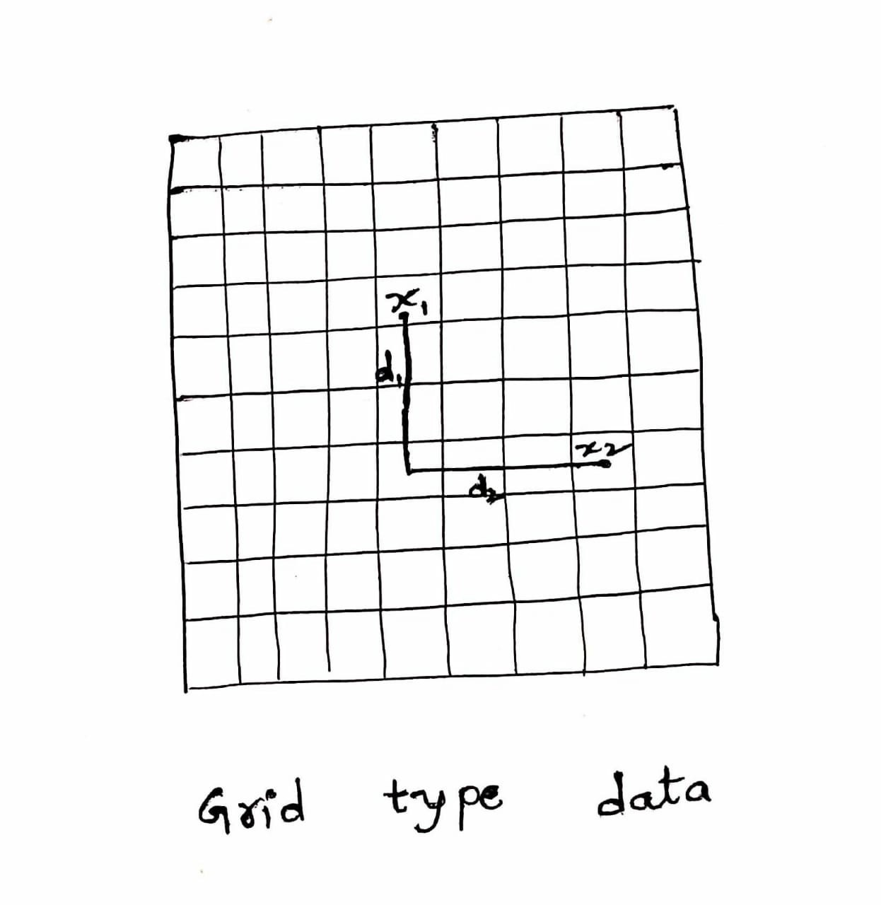

## Geometric Intuition of KNN

#### A simple example to understand the intuition behind KNN

Let us start with a simple example. Consider the following table – it consists of the height, age and weight (target) value for 10 people. As you can see, the weight value of ID11 is missing. We need to predict the weight of this person based on their height and age.

*Note: The data in this table does not represent actual values. It is merely used as an example to explain this concept.*

For a clearer understanding of this, below is the plot of height versus age from the above table:

In the above graph, the y-axis represents the height of a person (in feet) and the x-axis represents the age (in years). The points are numbered according to the ID values. The yellow point (ID 11) is our test point.

If I ask you to identify the weight of ID11 based on the plot, what would be your answer? You would likely say that since ID11 is closer to points 5 and 1, so it must have a weight similar to these IDs, probably between 72-77 kgs (weights of ID1 and ID5 from the table). That actually makes sense, but how do you think the algorithm predicts the values? We will find that out in this article.

#### How does the KNN algorithm work?

As we saw above, KNN algorithm can be used for both classification and regression problems. The KNN algorithm uses ‘feature similarity’ to predict the values of any new data points. This means that the new point is assigned a value based on how closely it resembles the points in the training set. From our example, we know that ID11 has height and age similar to ID1 and ID5, so the weight would also approximately be the same.

Had it been a classification problem, we would have taken the mode as the final prediction. In this case, we have two values of weight – 72 and 77. Any guesses on how the final value will be calculated? The average of the values is taken to be the final prediction.

Below is a stepwise explanation of the algorithm:

1. First, the distance between the new point and each training point is calculated.

2. The closest k data points are selected (based on the distance). In this example, points 1, 5, 6 will be selected if the value of k is 3. We will further explore the method to select the right value of k later in this article.

3. The average of these data points is the final prediction for the new point. Here, we have weight of ID11 = (77+72+60)/3 = 69.66 kg.

#### Geometric Intuition

*Assumption:- KNN assumes that all our data point geometrically close to each other or in other words neighborhood points should be close to each other.*

As an example dataset I’m taking here some reviews(product reviews) we all know there are positive reviews and negative reviews they all are mixed up. We have to classify positive or negative points let’s see the reviews in 2D

*Task:- the idea of KNN as name says that any given new point(review) find the nearest neighborhood points of the given new point then calculate the Majority vote and then classify it*

#### How KNN works and Math

**Majority Vote:-** If it is a Classification or Regression problem we take K(in the above case K=5) points as nearest or surrounding point values of any given point of these K points which belong to the majority class we classify given point as that class. We are given in the dataset {Xi, Yi} we take corresponding Yi-values for K data points. **When we are selecting the K value most of the times K should be an odd number if is even if we get 2 positive points and 2 negative points we can’t take the majority vote when K is even.**

**Distance measurements of data points?**

We find the nearest or neighborhood points using the distance there are a lot of distance available in Mathematics we will see some of the distances when to use what?

1. Euclidean Distance(L2 Norm)
   
   Euclidean Distance = $(\sum_{i = 1}^{d} (x_{1i} - x_{2i})^2)^{1/2}$

   Euclidean distance finds the shortest distance between two points when we have high dimensional data it is not preferable.

2. Manhattan Distance(L1 norm)
   
   

   Manhattan Distance = $\sum_{i = 1}^{d} |x_{1i} - x_{2i}|$

    Manhattan distance measures the distance either vertically or horizontally it is used when we have grid type of data like for instance modern cities roads are vertical or horizontal in this scenario we have to follow the roads we can’t jump over the buildings.

    Manhattan distance is preferable over Euclidean distance in the case of when we have high dimensional data.

3. Minkowski Distance

    Manhattan Distance = $(\sum_{i = 1}^{d} |x_{1i} - x_{2i}|^p)^{1/p}$

    In Minkowski distance, if put p=1 it would be Manhattan distance if put p=2 it would be Euclidean distance .

4. Hamming Distance

It has limited applications, it is used in especially in strings if we are measuring two string in which locations strings are different.

**Finding the right K**

In KNN K is the hyperparameter intuitively when K is small our model will overfit because when K is small it considers only a few points and K is large it considers very large points and it does not the given point belongs to which class so when K is large it will underfit.

    When K is a small model Overfits when K is large model Underfits so we have to choose K-values somewhere middle if plot cross-validation error we will know the right K

#### KNN for Regression

KNN easily extended to regression in classification we take the Majority vote in the Regression we Yi’s are no more classes Yi’s are real-world values so we take Mean or Median based on our requirement and data

The corresponding data points Yi’s(Y1, Y2, Y3, Y4…..) these all are real values find the mean or median.

#### Failure Cases of KNN?

1. When given data points very far away from the data points it can not find any surrounding data points so we can not say the given data point belongs to positive or negative.

2. When our data set spread randomly or in other words mixed up all the classes we can not find which class it belongs to so, it fails.

#### Time and Space complexity

**Time complexity:-** For each point, we have to find the distance for n data points that is O(nd) we should keep the smallest distances if the d(dimension) is smaller than n(data points) we can say it is O(n)

**Space complexity:-** When we count the distance between the points all the data points should be stored in the memory so, we need the space O(nd)

Reference taken from :- https://medium.com/datadriveninvestor/understanding-machine-learning-algorithms-knn-812840e3e284 