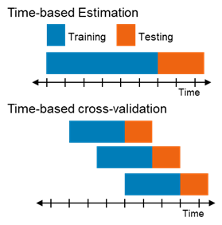

## Time Based Cross Validation

Training and evaluating machine learning models usually require a training set and a test set. In most cases, train and test splitting is done randomly by taking 20% of the data as test data, unseen by the model and using the rest for training.

Like in case of e-commerce website we can have reviews for various products. These reviews can have timestamps also. In such scenarios it’s better to use time-based strategy.

When dealing with time-related and dynamically changing environments, where the characteristics of the environment change throughout time, it is best to use time-based splitting to provide statistically robust model evaluation and best simulate real-life scenarios. For this we should use time-based cross validation, a method taken from the time-series field, which forms a type of “sliding window” training approach.



This approach is well known in the time-series domain, where we have a signal which is a sequence taken at successive equally spaced points in time.

But what happens when our data is not a time-series, but still have a time dimension which is very important?

### Example of a problem requires time-based cross-validation

We would like to predict delivery time of an order. Each record is an order, represented by set of features to create data table. We know when each order happened, and several orders could be placed on the same date. Detailed explanation of such problem could be found in my previous blog. In this case, our intention was to train a new model based on last month orders, then apply it to predict the delivery time of next week’s orders.
In order to best mimic real world, we should train our models using data taken from a time period of a month, then test them on new data captured from the following week. To create robust and general models, we should use several splitting-points in time and apply time-based cross validation. Our final test results would be the weighted average over all test windows.

*We need to pay attention to 3 important aspects:*
1. **Time-based train\test split-** in each split, test indices must be higher than before.

2. We would like to choose our **train\test set sizes** in order to mimic real world scenarios in which we will train a model over some period and then apply it on the upcoming period. For example- train the model over last month data and apply it to predict on the upcoming week data.

3. **Dates matter.** For our intention, the number of records in each set does not matter. What matters is the size of the windows in terms of days. We would like to split the data so that each window will consist data from X days.

### Other partial solutions

Scikit-learn has TimeSeriesSplit method, but it has several drawbacks. Assuming our data is sorted by time, this method splits it into train\test sets in a “sliding window” approach, but it doesn’t allow us to choose the sets sizes, we can only choose how many splits we would like to have. Scikit-learn TimeSeriesSplit also assumes that there is one observation per date, and therefore does not address 2 and 3 above.

Another solution is the one suggested by Germayne and presented in his blog. He explains very well the entire approach and the differences from Scikit-learn method. One of the inputs for this solution is the train set size (called initial) and test set size (called horizon), but it creates sets containing a fixed number of records. For our purpose, we should create sets contain fixed number of days. This solution does not address point 3.

### Suggested solution

Therefore, I have written my own solution for time-based train and test splitting, that not only allow us to choose relevant set sizes, but also address the significant aspect of considering the window size in terms of days (and not in terms of records).

*The returned CV splits works like any other scikit-learn cross validator and could be used with any of their methods.*

Note that your data frame must have one column that contains the date for each record, as this solution leverages the dates of the data.

### Steps for time-based splitting

1. Let say we have amazon dataset with n reviews ($D_{n}$). Sort the reviews based on timestamp in ascending order.
2. Now split the first 60 percent data which is oldest data for $D_{train}$.
3. Split the rest 20 percent data for $D_{cv}$ and 20 percent data for $D_{test}$. 

### Parameters:

- train_period: int, default=30
  Number of time units to include in each train set.
- test_period: int, default=7
  Number of time units to include in each test set.
- freq: string, default=’days’
  Frequency of input parameters. possible values are: days, months, years, weeks, hours, minutes, seconds.

### Methods:

```get_n_splits(self)```
Returns the number of splitting iterations in the cross-validator

```split(self, data, validation_split_date=None, date_column=’record_date’, gap=0)```
Returns list of tuples (train_index, test_index) similar to sklearn cross-validators.

- data: pandas DataFrame
  Your data, contain one column that indicates the record’s date
- validation_split_date: datetime.date
  First date to perform the splitting on. This is the date when the first test set starts.
- date_column: string
  Date of each record
- gap: int
  For cases the test set does not come right after the train set, *gap* days are left between train and test sets

```python
import pandas as pd
import datetime
from datetime import datetime as dt
from dateutil.relativedelta import *

class TimeBasedCV(object):
    '''
    Parameters 
    ----------
    train_period: int
        number of time units to include in each train set
        default is 30
    test_period: int
        number of time units to include in each test set
        default is 7
    freq: string
        frequency of input parameters. possible values are: days, months, years, weeks, hours, minutes, seconds
        possible values designed to be used by dateutil.relativedelta class
        deafault is days
    '''
    
    
    def __init__(self, train_period=30, test_period=7, freq='days'):
        self.train_period = train_period
        self.test_period = test_period
        self.freq = freq

        
        
    def split(self, data, validation_split_date=None, date_column='record_date', gap=0):
        '''
        Generate indices to split data into training and test set
        
        Parameters 
        ----------
        data: pandas DataFrame
            your data, contain one column for the record date 
        validation_split_date: datetime.date()
            first date to perform the splitting on.
            if not provided will set to be the minimum date in the data after the first training set
        date_column: string, deafult='record_date'
            date of each record
        gap: int, default=0
            for cases the test set does not come right after the train set,
            *gap* days are left between train and test sets
        
        Returns 
        -------
        train_index ,test_index: 
            list of tuples (train index, test index) similar to sklearn model selection
        '''
        
        # check that date_column exist in the data:
        try:
            data[date_column]
        except:
            raise KeyError(date_column)
                    
        train_indices_list = []
        test_indices_list = []

        if validation_split_date==None:
            validation_split_date = data[date_column].min().date() + eval('relativedelta('+self.freq+'=self.train_period)')
        
        start_train = validation_split_date - eval('relativedelta('+self.freq+'=self.train_period)')
        end_train = start_train + eval('relativedelta('+self.freq+'=self.train_period)')
        start_test = end_train + eval('relativedelta('+self.freq+'=gap)')
        end_test = start_test + eval('relativedelta('+self.freq+'=self.test_period)')

        while end_test < data[date_column].max().date():
            # train indices:
            cur_train_indices = list(data[(data[date_column].dt.date>=start_train) & 
                                     (data[date_column].dt.date<end_train)].index)

            # test indices:
            cur_test_indices = list(data[(data[date_column].dt.date>=start_test) &
                                    (data[date_column].dt.date<end_test)].index)
            
            print("Train period:",start_train,"-" , end_train, ", Test period", start_test, "-", end_test,
                  "# train records", len(cur_train_indices), ", # test records", len(cur_test_indices))

            train_indices_list.append(cur_train_indices)
            test_indices_list.append(cur_test_indices)

            # update dates:
            start_train = start_train + eval('relativedelta('+self.freq+'=self.test_period)')
            end_train = start_train + eval('relativedelta('+self.freq+'=self.train_period)')
            start_test = end_train + eval('relativedelta('+self.freq+'=gap)')
            end_test = start_test + eval('relativedelta('+self.freq+'=self.test_period)')

        # mimic sklearn output  
        index_output = [(train,test) for train,test in zip(train_indices_list,test_indices_list)]

        self.n_splits = len(index_output)
        
        return index_output
    
    
    def get_n_splits(self):
        """Returns the number of splitting iterations in the cross-validator
        Returns
        -------
        n_splits : int
            Returns the number of splitting iterations in the cross-validator.
        """
        return self.n_splits 
```

### Examples- how to use

```python
# How to use TimeBasedCV
data_for_modeling=pd.read_csv('data.csv', parse_dates=['record_date'])
tscv = TimeBasedCV(train_period=30,
                   test_period=7,
                   freq='days')
for train_index, test_index in tscv.split(data_for_modeling,
                   validation_split_date=datetime.date(2019,2,1), date_column='record_date'):
    print(train_index, test_index)

# get number of splits
tscv.get_n_splits()

#### Example- compute average test sets score: ####
X = data_for_modeling[['record_date',columns]]
y = data_for_modeling[label]
from sklearn.linear_model import LinearRegression
import numpy as np

scores = []
for train_index, test_index in tscv.split(X, validation_split_date=datetime.date(2019,2,1)):

    data_train   = X.loc[train_index].drop('record_date', axis=1)
    target_train = y.loc[train_index]

    data_test    = X.loc[test_index].drop('record_date', axis=1)
    target_test  = y.loc[test_index]

    # if needed, do preprocessing here

    clf = LinearRegression()
    clf.fit(data_train,target_train)

    preds = clf.predict(data_test)

    # accuracy for the current fold only    
    r2score = clf.score(data_test,target_test)

    scores.append(r2score)

# this is the average accuracy over all folds
average_r2score = np.mean(scores)
#### End of example ####

#### Example- RandomizedSearchCV ####
from sklearn.model_selection import RandomizedSearchCV
from lightgbm import LGBMRegressor
from random import randint, uniform

tscv = TimeBasedCV(train_period=10, test_period=3)
index_output = tscv.split(data_for_modeling, validation_split_date=datetime.date(2019,2,1))

lgbm = LGBMRegressor()

lgbmPd = {" max_depth": [-1,2]
         }

model = RandomizedSearchCV(
    estimator = lgbm,
    param_distributions = lgbmPd,
    n_iter = 10,
    n_jobs = -1,
    iid = True,
    cv = index_output,
    verbose=5,
    pre_dispatch='2*n_jobs',
    random_state = None,
    return_train_score = True)

model.fit(X.drop('record_date', axis=1),y)
model.cv_results_
#### End of example ####
```

Reference:- https://towardsdatascience.com/time-based-cross-validation-d259b13d42b8