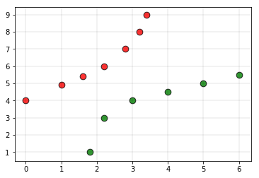
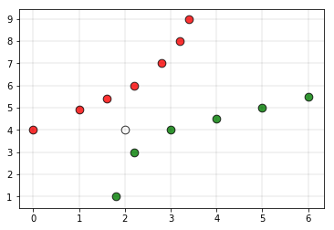

## Weighted KNN

Weighted kNN is a modified version of k nearest neighbors. One of the many issues that affect the performance of the kNN algorithm is the choice of the hyperparameter k. If k is too small, the algorithm would be more sensitive to outliers. If k is too large, then the neighborhood may include too many points from other classes.
Another issue is the approach to combining the class labels. The simplest method is to take the majority vote, but this can be a problem if the nearest neighbors vary widely in their distance and the closest neighbors more reliably indicate the class of the object. 

### Intuition

Consider the following training set



The red labels indicate the class 0 points and the green labels indicate class 1 points.

Consider the white point as the query point(the point whose class label has to be predicted)



If we give the above dataset to a kNN based classifier, then the classifier would declare the query point to belong to the class 0. But in the plot, it is clear that the point is more closer to the class 1 points compared to the class 0 points. To overcome this disadvantage, weighted kNN is used. In weighted kNN, the nearest k points are given a weight using a function called as the kernel function. The intuition behind weighted kNN, is to give more weight to the points which are nearby and less weight to the points which are farther away. Any function can be used as a kernel function for the weighted knn classifier whose value decreases as the distance increases. The simple function which is used is the inverse distance function.

### Algorithm

- Let L = { ( xi , yi ) , i = 1, . . . ,n } be a training set of observations xi with given class yi and let x be a new observation(query point), whose class label y has to be predicted.
- Compute d(xi, x) for i = 1, . . . ,n , the distance between the query point and every other point in the training set.
- Select D’ ⊆ D, the set of k nearest training data points to the query points
- Predict the class of the query point, using distance-weighted voting. The v represents the class labels. Use the following formula

    $y'= \operatorname{arg\,max}_v \sum_{(x_{i}, y_{i})\in D_{z} } w_{i} \times I(v=y_{i})$

### Implementation

Consider 0 as the label for class 0 and 1 as the label for class 1. Below is the implementation of weighted-kNN algorithm.

```python

# Python3 program to implement the 
# weighted K nearest neighbour algorithm.  
  
import math  
  
def weightedkNN(points,p,k=3):  
    '''  
    This function finds classification of p using  
    weighted k nearest neighbour algorithm. It assumes only two  
    two classes and returns 0 if p belongs to class 0, else  
    1 (belongs to class 1).  
  
    Parameters -  
        points : Dictionary of training points having two keys - 0 and 1  
            Each key have a list of training data points belong to that  
  
        p : A tuple ,test data point of form (x,y)  
  
        k : number of nearest neighbour to consider, default is 3  
    '''
  
    distance=[]  
    for group in points:  
        for feature in points[group]:  
  
            #calculate the euclidean distance of p from training points  
            euclidean_distance = math.sqrt((feature[0]-p[0])**2 +(feature[1]-p[1])**2)  
  
            # Add a tuple of form (distance,group) in the distance list  
            distance.append((euclidean_distance,group))  
  
    # sort the distance list in ascending order  
    # and select first k distances  
    distance = sorted(distance)[:k]  
  
    freq1 = 0 # weighted sum of group 0  
    freq2 = 0 # weighted sum of group 1  
  
    for d in distance: 
        if d[1] == 0: 
            freq1 += (1 / d[0]) 
              
        elif d[1] == 1:  
            freq2 += (1 /d[0]) 
              
  
    return 0 if freq1>freq2 else 1
  
# Driver function  
def main():  
  
    # Dictionary of training points having two keys - 0 and 1  
    # key 0 have points belong to class 0  
    # key 1 have points belong to class 1  
  
    points = {0:[(0, 4),(1, 4.9),(1.6, 5.4),(2.2, 6),(2.8, 7),(3.2, 8),(3.4, 9)],  
            1:[(1.8, 1),(2.2, 3),(3, 4),(4, 4.5),(5, 5),(6, 5.5)]}  
  
    # query point p(x,y)  
    p = (2, 4)  
  
    # Number of neighbours  
    k = 5
  
    print("The value classified to query point is: {}".format(weightedkNN(points,p,k)))  
  
if __name__ == '__main__':  
    main()  
```

Output:

    The value classified to query point is: 1


Reference:- https://www.geeksforgeeks.org/weighted-k-nn/

