## How does a k-d tree find the K nearest neighbors? 

K-d trees are a wonderful invention that enable $O(klogn)$ (expected) lookup times for the k nearest points to some point x. This is extremely useful, especially in cases where an $O(nd)$ lookup time is intractable already where d is number of dimension.

### What is k-dimensional data?

If we have a set of ages say, {20, 45, 36, 75, 87, 69, 18}, these are one dimensional data. Because each data in the array is a single value that represents age.

What if instead of only age we have to also store the salary for a person? The data would look like [{20, 1500}, {45, 5000}, {36, 4000}, {75, 2000}, {87, 0}, {18, 1000}]. This data is two dimensional as each data set contains two values. Similarly, if we add one more attribute to it, say education it would be a 3 dimensional data and so on.

### Why are we talking about efficiency?

Suppose, given a data point {43, 4650}, we want to know which person has a similar profile. In this particular example, it would be {45, 5000} whose age and salary both are close to this input. If we want the second closest person, it would be {36, 4000}. How did we find that? Well, we could iterate over the 6 data points and check against each of them. We would end up doing comparison against each of them. That is O(n) complexity. Not bad, but when we have millions of points it would be very expensive.

When we have just one dimension, instead of a linear search with O(n) complexity, we use Binary Search Tree (BST) with O(log2(n)) complexity. The difference is huge. For a million rows where linear search would take one million comparisons, binary search would take only 20 comparisons. This is because O(n) = O(1000, 000), meaning 1000, 000 comparisons and O(log2(n)) = O(log2(1000, 000)), meaning 20 comparisons. If each operation takes 1 millisecond BST would take 20 milliseconds, whereas linear search would take 1000 sec, almost 16 minutes. 20 milliseconds vs. 16 minutes.

### How do we split the points?

We can extend BST to do this. This is what Jon Louis Bentley created in 1975. K-d tree is called 2-d tree or k-d tree with 2-dimension when k = 2 and so on. In BST, at each level of the tree we split the data points based on the data value. Since, BST deals with just one dimension the question does not arise which dimension. But in k-d tree since we have more than one dimension. At each level we can choose to split the data based on only one dimension. So if we have 3 dimensions: x, y and z, at first level we split the data sets using x dimension. At 2nd level we do so using y dimension and at 3rd level we use z dimension. At 4th level we start again with x dimension and so on. Of course, we can continue splitting only if we have more data left. If we are splitting the points based on x dimension for a certain level then we call x the cutting dimension for this level.

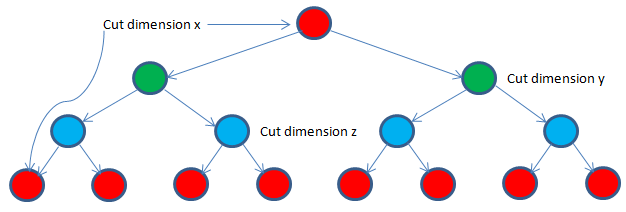

### Where do the data points reside?

A k-d tree can have all the data points residing only in the leaf nodes. The intermediary nodes could be used to save the (non-data) splitting values. Alternatively, all nodes – internal and leaf, could save data points. In our case, we are saving data in all nodes.

### Balanced or Skewed

The above tree looks very symmetrical. That means, both the left sub-tree of right sub-tree having almost the same number of nodes. If the height of left and right sub-tree differs at max by 1 then it is called a balanced tree.

The more a tree is balanced the more efficient it is to do search and other operations on it. For example, if we have to do a search for a number in the above tree with height = 3, it would take at max 4 (height + 1) probes. If it were a skewed tree where most or all nodes reside on the same side, it would have taken 15 probes in the worst case, similar to a linear search.

### How can we build a balanced tree?

Let us start with an example set to walk through for the rest of the post. Say, we have 13 points in a two dimensional space. They are: (1, 3), (1, 8), (2, 2), (2, 10), (3, 6), (4, 1), (5, 4), (6, 8), (7, 4), (7, 7), (8, 2), (8, 5) and (9, 9) respectively.

Say, at level 1 the first dimension, say x is chosen as the cutting dimension. Since we want half the points to fall on the left side and the rest half on the right side we can simply sort (typically with O(n log2(n)) complexity) he data points on x dimension and chose the middle as the root. We make sure that we remain consistent in choosing for left side points whose cutting dimension value is less than the same for root and more than or equal to for the right.

In this example, if we sort the 13 points based on the x dimension values then the root would be (5, 4). So with (5, 4) being the root at level 1, the left side points would be: (1, 3), (1, 8), (2, 2), (2, 10), (3, 6), and (4, 1). And the right side points would be (6, 8), (7, 4), (7, 7), (8, 2), (8, 5) and (9, 9). We call the tree building procedure recursively for each half data sets. We also indicate that y dimension of the data point would be chosen as the cutting dimension for the next level sub-trees.

Now we have the following data points to build the left side tree with cutting dimension being y: (1, 3), (1, 8), (2, 2), (2, 10), (3, 6), and (4, 1). We can chose (3, 6) as the root, at level 2 after sorting them according to y dimension. The left side points would be (4, 1), (2, 2), and (1, 3) and the right side points would be (1, 8) and (2, 10).

At the end the tree would look like below:

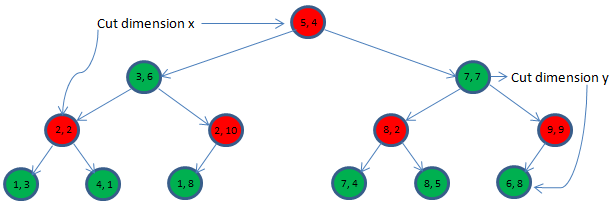

### Bounding Box

We could visualize the points and the tree it in a different way. Let us put the 2 dimensional 13 points in x-y coordinate system.

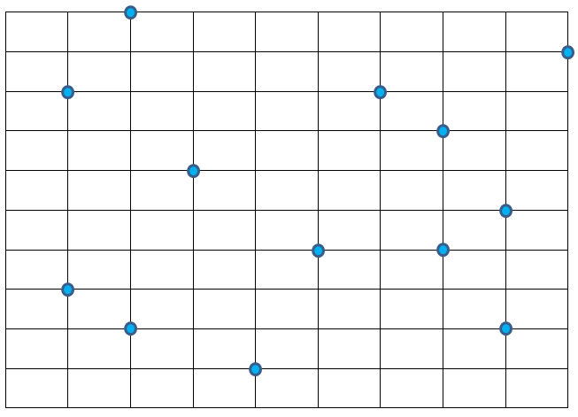

The root (5, 4) at level 1 owns the whole bounding box. This root then divides the whole region into two bounding boxes: bounding box A and bounding box B, owned by second level roots (3, 6) and (8, 2) respectively.

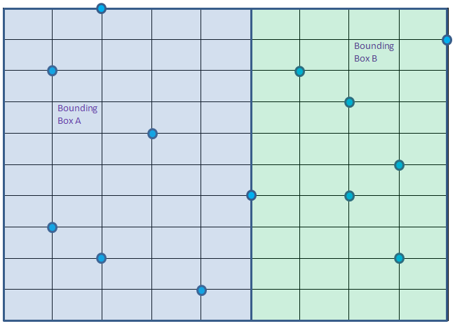

Root (3, 6) would then divide the bounding box A into bounding box C and D owned by 3rd level roots (2, 2) and (2, 10) respectively. It does so using y as the cutting dimension meaning splitting the points inside A based on y dimension values.

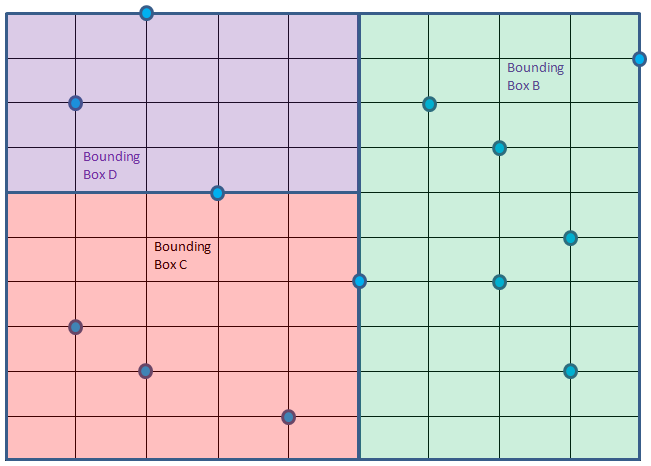

Bounding box C rooted at (2, 2) is further divided into E and F, this time using x as the cutting dimension.

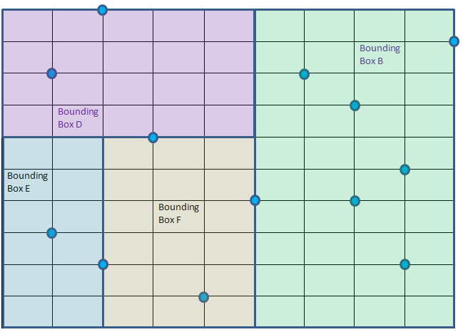

Bounding box E can be further divided into G and H using cutting dimension y but none of them has any point. Similarly, bounding box F can be further divided into I and J using cutting dimension y, once again none of them has any point.

Bounding box D can be divided into K and L using cutting dimension x. K having one point while L having no point inside it. K is further divided into two M and N using cutting dimension y having no points left for any of them.

Similarly bounding box B will be divided into smaller boxes.

The final bounding boxes are shown below. Even though bigger bounding boxes like A is not shown here, they are all present nonetheless. Only first level division of the B bounding box is shown where (7, 7) has split it into O and P.

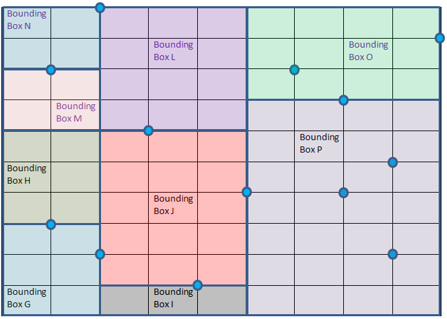

### Nearest Neighbor Search

**How many neighbors do we want?**

We are interested to get k nearest neighbors, where k can be 1 2, 3 or any value. However, we will first see how to get the closest one point. It can then be easily extended to understand how to get more.

**Points inside the same box of the query point are not necessarily the closest to query point**

Suppose, we have to find the nearest neighbor of Query point Q = (4, 8) as shown below in red color. It falls inside bounding box D. But it is obvious that the closest point to Q does not fall within box D, rather it is inside Box B. Well, you can see point (6, 8) is the closest to Q. A person living near the Western border of Singapore is closer to a person living in the adjacent border of Malaysia than a person living in the eastern side of Singapore.

**How to find the closest point?**

We will extend the same binary search principle here. We start at root and then traverse down the tree finding the promising bounding boxes to search first and at the same time skip bounding boxes where the chance to get a closer point than the closest one to the query point found so far are thinner.

We will maintain the closest point (to Q) and minimum distance (distance between closest point and Q) found so far, at first they are null and infinite respectively. We start at root, with cutting dimension being x and do the following:

1. If we reach a null node return.
2. If the boundary box owned by the present root has no chance of having a point closer than minimum distance then return, meaning skip traversing that sub-tree altogether. We do so by checking the distance from Q to the bounding box. In two dimension case, it is Q to a rectangle (not a distance from Q to an actual point in the bounding box). This is how we prune search space.
3. If the present root is closer to Q than minimum distance, we save it as the closest point and also update the minimum distance.
4. Now we have two choices: traverse left sub-tree or traverse right sub-tree. We will compare the cutting dimension (at level 1 it is x, at level 2 it is y, at level 3 it is again x and so on) value of Q to that of root. If Q’s x is dimension value is smaller than that of root then we traverse left first, right second. So we are calling both of them but at a certain order with the hope that the first traversed sub-tree would give a closer point than any point the other side sub-tree could possibly offer. So next time when we would traverse the other sub-tree we can do a quick check and completely skip traversing that sub-tree. Something that might not materialize as well.

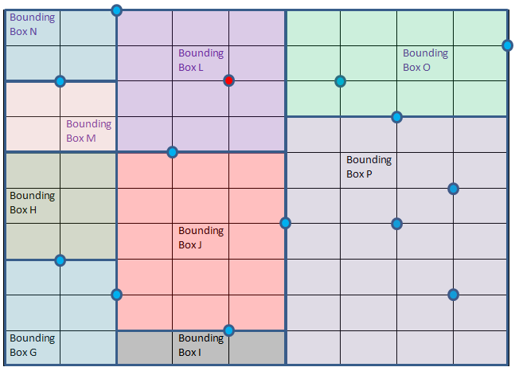

Let us walk through this particular example. At root (5, 4), closest point so far is null, minimum distance is also null. We set the root as the closet point and minimum distance (using commonly used Euclidean distance for continuous values) to ((x1 – x2)2 + (y1 –y2)2)1/2 = 4.12 (approx.). Now we have two bounding boxes A and B. The decision that we need to make is which one to traverse first? Q’s x dimension value 4 is smaller than root’s x dimension value that is 5. So we choose left first, right second. Both of them are to be called by using the cutting dimension y. The bounding box for each of the call is going to change. Well, we know each root owns a bounding box.

At the second call, root is (3, 6), bounding box is A. Distance from Q to A is zero as Q is within A. So we cannot skip traversing this sub-tree. Distance from (3, 6) to Q (4, 8) is 2.24, closer than existing minimum distance 4.12. Hence, we update our closest point to (3, 6) and minimum distance to 2.24. Next decision to make is again which side to traverse first. We have Q’s y value 8 that is more than present root’s y value 6. So we will traverse the right side first, left side second.

Next, the function is called with root, (2, 10), cutting dimension x and bounding box D. Distance between (2, 10) and Q (4, 8) = 2.83 that is larger than existing minimum distance. So we are not updating the closest point in this call. Next – choose which side to traverse first. Q’s x dimension 4 is bigger than root’s x dimension 2, hence right sub-tree is chosen first that is null anyway. So the call to it will return without doing anything.

Next call would be made with root (1, 8) that is 3 units away from Q. No improvement for the closest point. Also this root has no children. We have reached bottom of this side of the tree in our DFS search.

Next call is done with root (2, 2), far away from Q. But the bounding box owned by it is only 2 units away from Q. Hence, there is a chance that we might end up getting a closer point from this area. Hence, we cannot skip this tree. Right side to traverse first based on x dimension value comparison.

Root (4, 1), that is 8 units away from Q is called. It owns bounding box F that is 2 units away from Q. Once again cannot skip this area. Well, it has no child anyway.

Root (1, 3) is called that owns bounding box E that is 2.83 units away from Q, having no chance to offer any closer point. For the first time we can skip this area/sub-tree/bounding box.

We are done with the left side of level 1 root (5, 4). Now traverse right side.

Sub-tree with root (7, 7) owing bounding box O is called. **Subsequently sub-tree rooted at (6, 8) would be called and that would be the closest point at distance 2.**

**How much search space did we prune?**

We will skip traversing the left sub-tree rooted at (8, 2) that owns bounding box P. In terms of nodes we skipped only 4 nodes, 3 of them are rooted at (8, 2). Previously we skipped sub-tree rooted at (1, 3) as well. The green areas were pruned, meaning we did not search there. That was not quite efficient though!

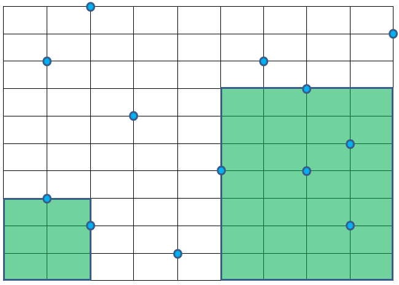

**How to get k nearest neighbors?**

Instead of keeping a single closest point we could maintain a priority queue (max heap) to keep k (say 2, 3 or any number) closest points. The first k points would be en-queued anyway. Onwards, a new point, if better, would replace the worst of the closest point found so far. That way we can maintain the k nearest points easily.

**Too few points is a problem**

If we have to construct a k-d tree with 20 dimensional data sets, we got to have around 220 data points. If we don’t have enough data then at many levels we will not have sufficient data to split. We will also end up with an unbalanced k-d tree where search and other operations would not be very efficient.

In general, we need k-d tree when we have higher dimensional data points. But when the dimension is too high other approaches might work better.

### How do we split the points?(Alternative post, Optional but easy explaination)

First, you need to understand what a k-d tree is. A k-d tree is a data structure that partitions space by repeatedly choosing a point in the data set to split the current partition in half. It accomplishes this by alternating the dimension which performs the split.

First, you need to understand what a k-d tree is. A k-d tree is a data structure that partitions space by repeatedly choosing a point in the data set to split the current partition in half. It accomplishes this by alternating the dimension which performs the split.

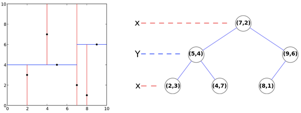

So here, we first start by splitting at the line x=7, then we split by y=4 on the left and y=6 on the right. We do so recursively until there are no points left in each region.

Now, it’s simple to understand how a nearest neighbor can be found in $O(logn)$ time. Say that we have the following purple query point.

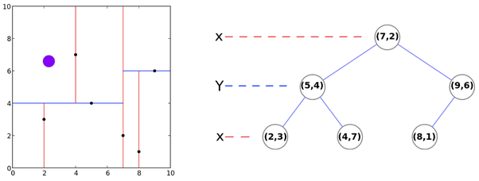

Now, we begin at the root of the tree. Now notice that our point must lie either on the left or right partition, but not both! That is, we can eliminate an entire part of the k-d tree by determining which of *(5,4)* or *(9,6)* are closer.

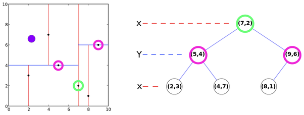

We can evaluate the Euclidean distance to find that *(5,4)* is closer. Hence, we can eliminate the right partition and continue recursively until the bottom.

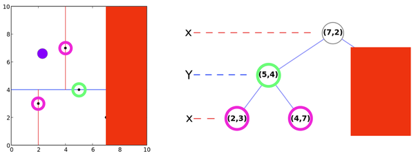

And finally, we eliminate the bottom region, and we get:

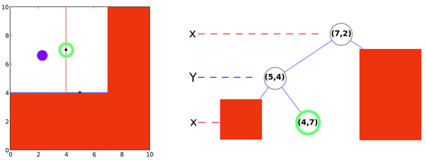

And this is the basic gist of it! Note that it’s possible that you could finish earlier, if the current root is closer to the query point than either of the children. If so, save that as the current best and continue down the tree.

If you’re finding the k nearest neighbors, simply repeat this operation k times! However, rather than just the single nearest, then the process is very similar. You just ignore the nodes which you have already determined to be a nearest neighbor in a previous query.

I strongly believe that visual descriptions and color can be awesome tools to help teach computer science, and I think k-d trees are a great example of this.

### Limitations of kd tree in KNN

1. When d is not small 
   when d = 10; $2^d=1024$ 
   when d = 20; $2^d=1048576$

   When d increases, number of adjacent cells will be $2^d$.

   Now my time complexity is no more $O(log(n))$. It will be $O(2^d log(n))$.

   When $2^d \approx n$ ; the time complexity will be $O(n log(n))$ which is worse than brute-force($O(n)$).

2. Even when d is small, time complexity $O(log(n))$ holds true when data is uniformly distributed. However in real world data is never uniformly distributed and $O(log(n))$ moves towards $O(n)$.
3. kd-tree was never invented/designed for KNN. It is mainly used for 2D and 3D computer graphics. For nD when n is larger than 10, kd-tree never works well.

Reference 1:- https://www.quora.com/How-does-a-k-d-tree-find-the-K-nearest-neighbors

Reference 2:- https://gopalcdas.com/2017/05/24/construction-of-k-d-tree-and-using-it-for-nearest-neighbour-search/