## Locality-sensitive hashing (https://en.wikipedia.org/wiki/Locality-sensitive_hashing)

An effective way of reducing the dimensionality of your data. 

### Motivation

The task of finding nearest neighbours is very common. You can think of applications like finding duplicate or similar documents, audio/video search. Although using brute force to check for all possible combinations will give you the exact nearest neighbour but it’s not scalable at all. Approximate algorithms to accomplish this task has been an area of active research. Although these algorithms don’t guarantee to give you the exact answer, more often than not they’ll be provide a good approximation. These algorithms are faster and scalable.

Locality sensitive hashing (LSH) is one such algorithm. LSH has many applications, including:

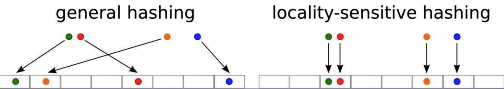

* Near-duplicate detection: LSH is commonly used to deduplicate large quantities of documents, webpages, and other files.
* Genome-wide association study: Biologists often use LSH to identify similar gene expressions in genome databases.
* Large-scale image search: Google used LSH along with PageRank to build their image search technology VisualRank.
* Audio/video fingerprinting: In multimedia technologies, LSH is widely used as a fingerprinting technique A/V data.

### General Idea

LSH refers to a family of functions (known as LSH families) to hash data points into buckets so that data points near each other are located in the same buckets with high probability, while data points far from each other are likely to be in different buckets. This makes it easier to identify observations with various degrees of similarity.

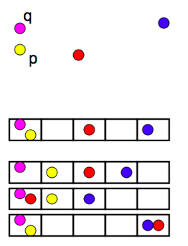

### Finding similar documents

Let’s try to understand how we can leverage LSH in solving an actual problem. The problem that we’re trying to solve:

    Goal: You have been given a large collections of documents. You want to find “near duplicate” pairs.

In the context of this problem, we can break down the LSH algorithm into 3 broad steps:

1. Shingling
2. Min hashing
3. Locality-sensitive hashing

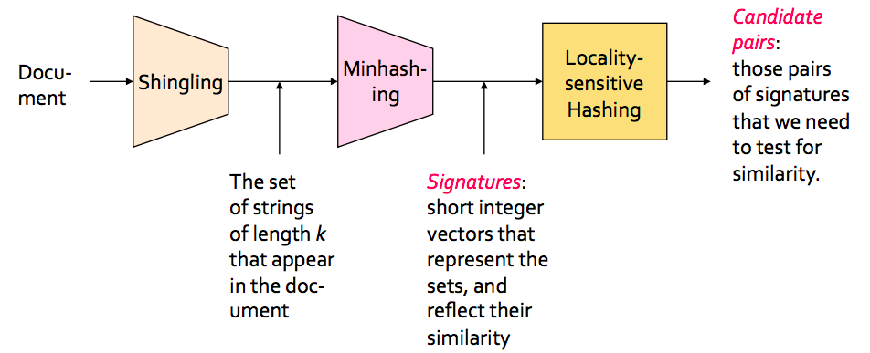

Don’t read much into the figure for now. It’s just to give you the idea of the process flow. We’ll discuss each step in detail.

### Shingling

In this step, we convert each document into a set of characters of length k (also known as k-shingles or k-grams). The key idea is to represent each document in our collection as a set of k-shingles.

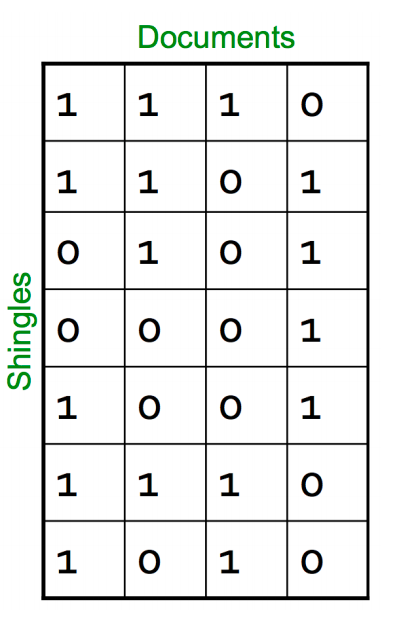

For ex: One of your document (D): “Nadal”. Now if we’re interested in 2-shingles, then our set: {Na, ad, da, al}. Similarly set of 3-shingles: {Nad, ada, dal}.

* Similar documents are more likely to share more shingles
* Reordering paragraphs in a document of changing words doesn’t have much affect on shingles
* k value of 8–10 is generally used in practice. A small value will result in many shingles which are present in most of the documents (bad for differentiating documents)

### Jaccard Index

We’ve a representation of each document in the form of shingles. Now, we need a metric to measure similarity between documents. Jaccard Index is a good choice for this. Jaccard Index between document A & B can be defined as:

$J(A, B) = \frac{|A \bigcap B|}{|A \bigcup B|}$

It’s also known as intersection over union (IOU).

Suppose A: “Nadal” and B: “Nadia”, then 2-shingles representation will be:

A: {Na, ad, da, al} and B: {Na, ad, di, ia}.

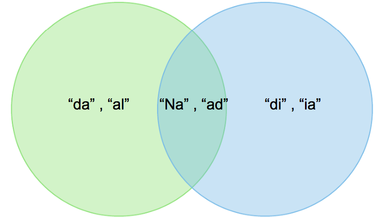

Jaccard Index = 2/6

More number of common shingles will result in bigger Jaccard Index and hence more likely that the documents are similar.

Let’s discuss 2 big issues that we need to tackle:

**Time complexity**

Now you may be thinking that we can stop here. But if you think about the scalability, doing just this won’t work. For a collection of n documents, you need to do n*(n-1)/2 comparison, basically O(n²). Imagine you have 1 million documents, then the number of comparison will be 5*10¹¹ (not scalable at all!).

**Space complexity**

The document matrix is a sparse matrix and storing it as it is will be a big memory overhead. One way to solve this is hashing.

### Hashing

The idea of hashing is to convert each document to a small signature using a hashing function H. Suppose a document in our corpus is denoted by d. Then:

* H(d) is the signature and it’s small enough to fit in memory
* If similarity(d1,d2) is high then Probability(H(d1)==H(d2)) is high
* If similarity(d1,d2) is low then Probability(H(d1)==H(d2)) is low

Choice of hashing function is tightly linked to the similarity metric we’re using. For Jaccard similarity the appropriate hashing function is **min-hashing**.

### Min hashing

This is the critical and the most magical aspect of this algorithm so pay attention:

Step 1: Random permutation (π) of row index of document shingle matrix.

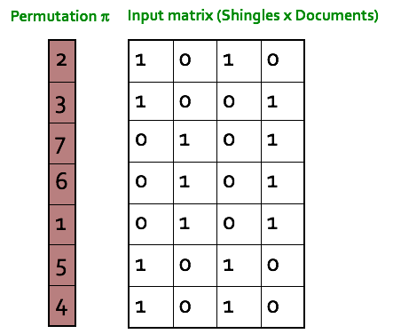

Step 2: Hash function is the index of the first (in the permuted order) row in which column C has value 1. Do this several time (use different permutations) to create signature of a column.

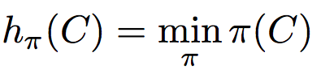

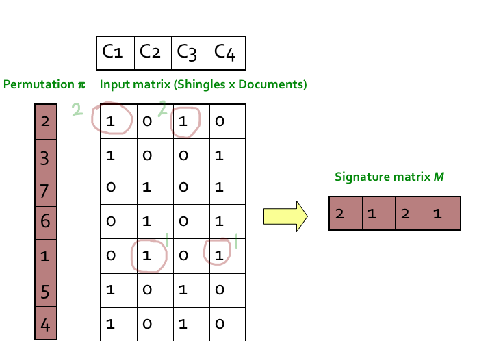

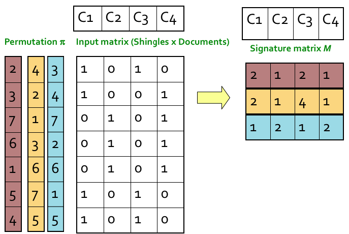

### Min-hash property

The similarity of the signatures is the fraction of the min-hash functions (rows) in which they agree. So the similarity of signature for C1 and C3 is 2/3 as 1st and 3rd row are same.

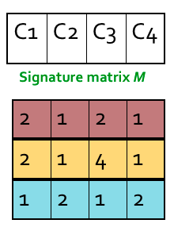

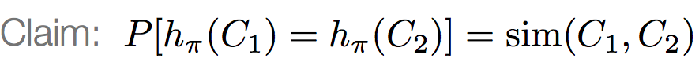

*Expected similarity of two signatures is equal to the Jaccard similarity of the columns. The longer the signatures, the lower the error*

In the below example you can see this to some extent. There is difference as we have signatures of length 3 only. But if increase the length the 2 similarities will be closer.

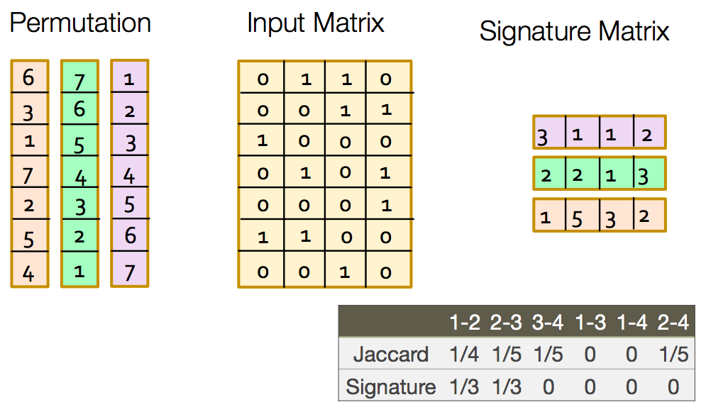

So using min-hashing we have solved the problem of space complexity by eliminating the sparseness and at the same time preserving the similarity.

### Locality-sensitive hashing

*Goal: Find documents with Jaccard similarity of at least t*

The general idea of LSH is to find a algorithm such that if we input signatures of 2 documents, it tells us that those 2 documents form a candidate pair or not i.e. their similarity is greater than a threshold t. Remember that we are taking similarity of signatures as a proxy for Jaccard similarity between the original documents.

**Specifically for min-hash signature matrix:**

* Hash columns of signature matrix M using several hash functions
* If 2 documents hash into same bucket for at least one of the hash function we can take the 2 documents as a candidate pair

Now the question is how to create different hash functions. For this we do band partition.

### Band partition

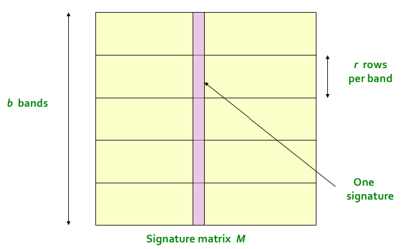

Here is the algorithm:

* Divide the signature matrix into b bands, each band having r rows
* For each band, hash its portion of each column to a hash table with k buckets
* Candidate column pairs are those that hash to the same bucket for at least 1 band
* Tune b and r to catch most similar pairs but few non similar pairs

There are few considerations here. Ideally for each band we want to take k to be equal to all possible combinations of values that a column can take within a band. This will be equivalent to identity matching. But in this way k will be a huge number which is computationally infeasible. For ex: If for a band we have 5 rows in it. Now if the elements in the signature are 32 bit integers then k in this case will be (2³²)⁵ ~ 1.4615016e+48. You can see what’s the problem here. Normally k is taken around 1 million.

The idea is that if 2 documents are similar then they will will appear as candidate pair in at least one of the bands.

### Choice of b & r

If we take b large i.e more number of hash functions, then we reduce r as b*r is a constant (number of rows in signature matrix). Intuitively it means that we’re increasing the probability of finding a candidate pair. This case is equivalent to taking a small t (similarity threshold)

Let’s say your signature matrix has 100 rows. Consider 2 cases:

b1 = 10 → r = 10

b2 = 20 → r = 5

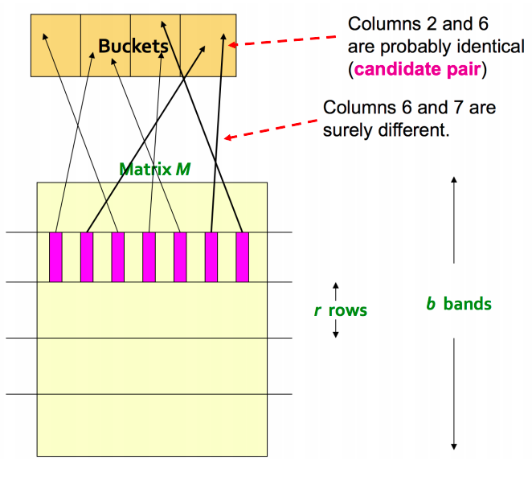

In 2nd case, there is higher chance for 2 documents to appear in same bucket at least once as they have more opportunities (20 vs 10) and fewer elements of the signature are getting compared (5 vs 10).

*Higher b implies lower similarity threshold (higher false positives) and lower b implies higher similarity threshold (higher false negatives)*

Let’s try to understand this through an example.

Setup:

* 100k documents stored as signature of length 100
* Signature matrix: 100*100000
* Brute force comparison of signatures will result in 100C2 comparisons = 5 billion (quite a lot!)
* Let’s take b = 20 → r = 5

**similarity threshold (t) : 80%**

We want 2 documents (D1 & D2) with 80% similarity to be hashed in the same bucket for at least one of the 20 bands.

P(D1 & D2 identical in a particular band) = (0.8)⁵ = 0.328

P(D1 & D2 are not similar in all 20 bands) = (1–0.328)^20 = 0.00035

This means in this scenario we have ~.035% chance of a false negative @ 80% similar documents.

Also we want 2 documents (D3 & D4) with 30% similarity to be not hashed in the same bucket for any of the 20 bands (threshold = 80%).

P(D3 & D4 identical in a particular band) = (0.3)⁵ = 0.00243

P(D3 & D4 are similar in at least one of the 20 bands) = 1 — (1–0.00243)^20 = 0.0474

This means in this scenario we have ~4.74% chance of a false positive @ 30% similar documents.

So we can see that we have some false positives and few false negatives. These proportion will vary with choice of b and r.

What we want here is something like below. If we have 2 documents which have similarity greater than the threshold then probability of them sharing the same bucket in at least one of the bands should be 1 else 0.

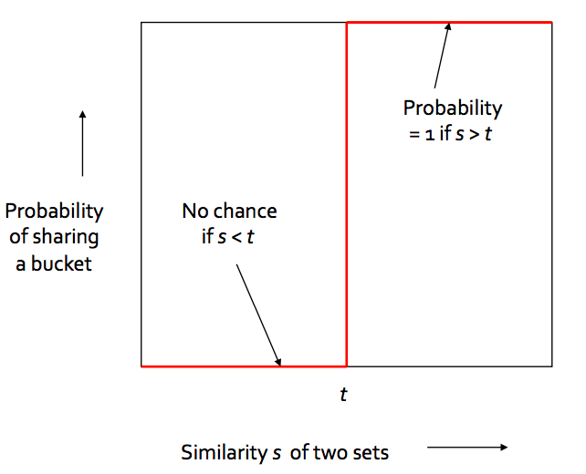

Worst case will be if we have b = number of rows in signature matrix as shown below.

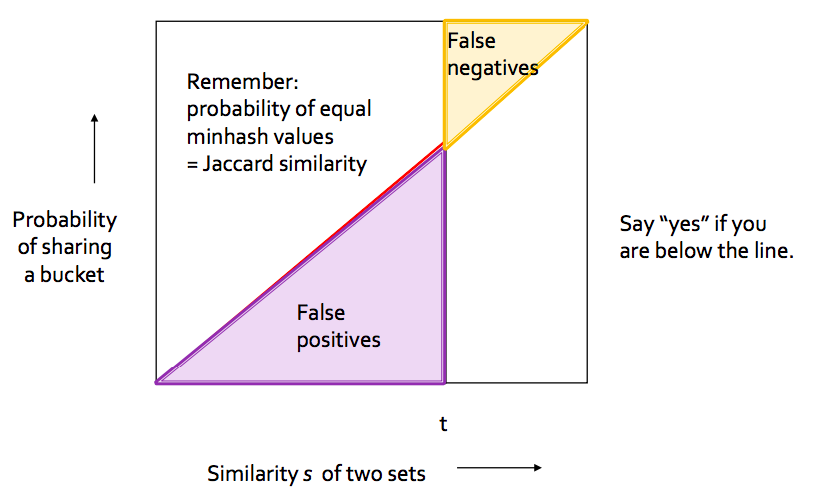

Generalised case for any b and r is shown below.

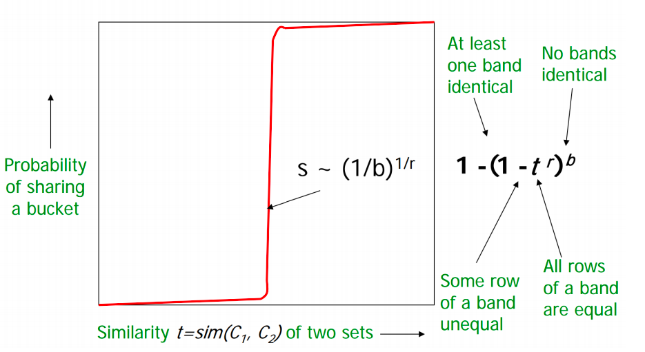

*Choose b and r to get the best S-curve i.e minimum false negative and false positive rate*

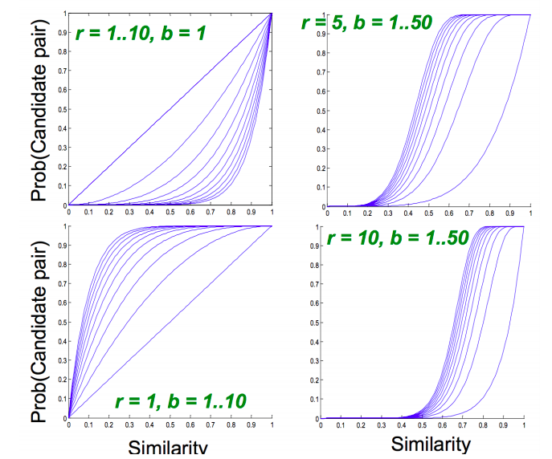

### LSH summary

* Tune M, b, r to get almost all document pairs with similar signatures, but eliminate most pairs that do not have similar signatures
* Check in main memory that candidate pairs really do have similar signatures

### Conclusion

I hope that you have a good understanding of this powerful algorithm and how it reduces the search time. You can imagine how LSH can be applicable to literally any kind of data and how much it’s relevant in today’s world of big data.

Reference:- https://towardsdatascience.com/understanding-locality-sensitive-hashing-49f6d1f6134