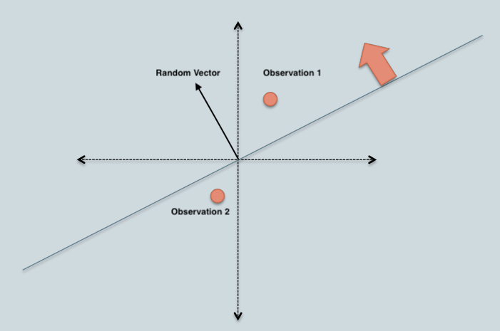
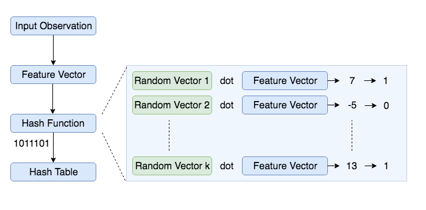
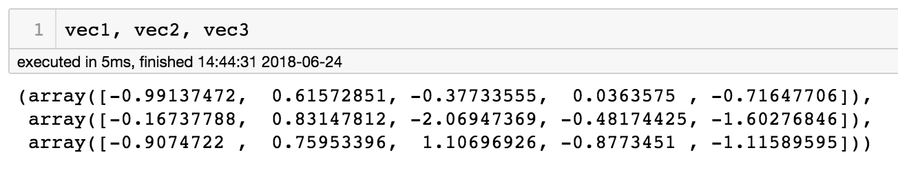
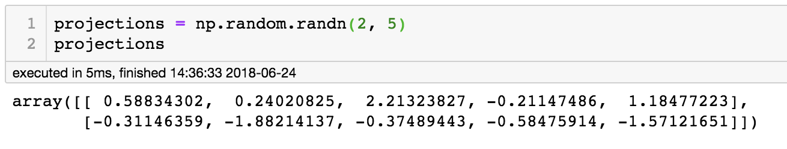
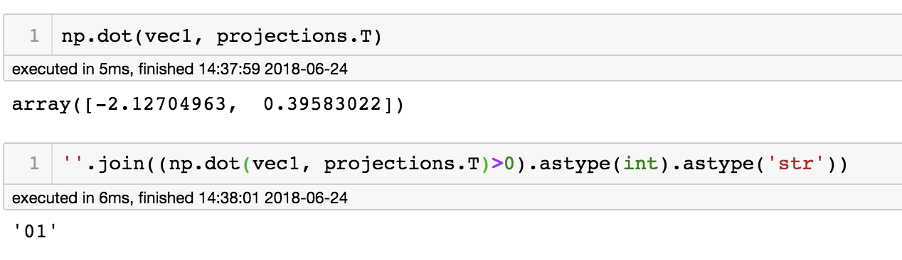
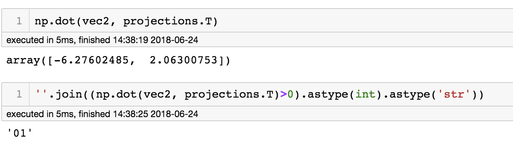
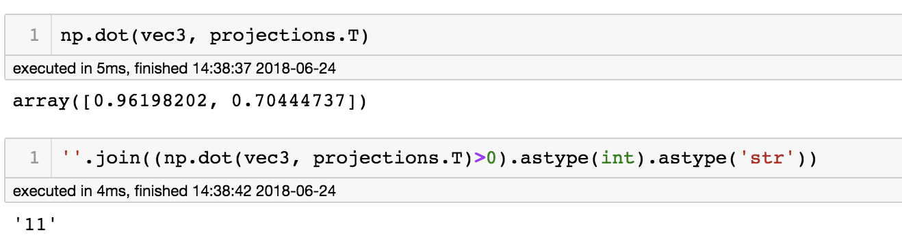
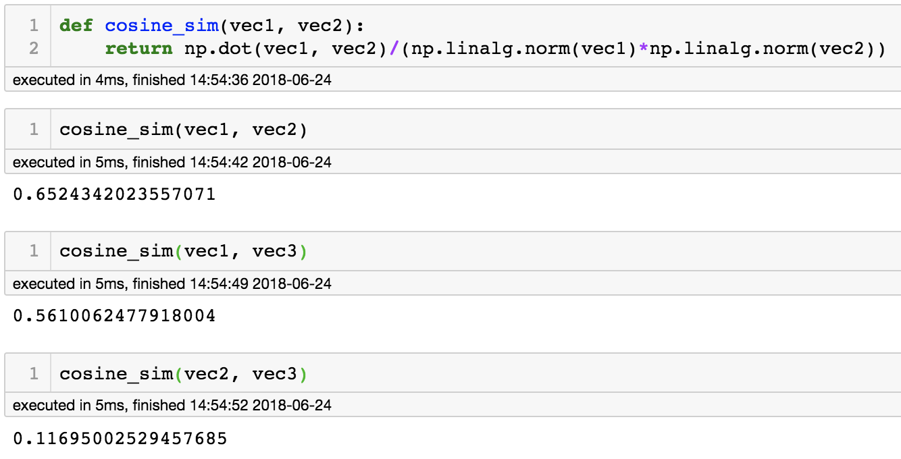

## Locality Sensitive Hashing for Similar Item Search

An efficient approach to identifying approximate nearest neighbors.

### Motivation

Everyone is aware of Shazam, the app that let’s you identify any song within seconds. The speed at which it identifies songs not only amazed me but also made me wonder how they are able to do this with a massive database of songs (~10 million). I realized this can be done using audio fingerprinting and Locality Sensitive Hashing (I’m pretty sure Shazam uses some advanced techniques). This article is an attempt to explain the steps and concepts involved in implementing a program to perform music search (similar item search in general).

Audio fingerprinting is the process of identifying unique characteristics from a fixed duration audio stream. Such unique characteristics can be identified for all existing songs and stored in a database. When we hear a new song, we can extract similar characteristics from the recorded audio and compare against the database to identify the song. However, in practice there will be two challenges with this approach:

1. High dimensionality of the unique characteristic/feature vector required to identify songs
2. Comparison of the recorded audio features against features of all songs in the database is expensive in terms of time and memory

The first challenge can be addressed using a dimensionality reduction technique like PCA and the second using a combination of clustering and nearest neighbor search. Locality Sensitive Hashing (hereon referred to as LSH) can address both the challenges by

1. reducing the high dimensional features to smaller dimensions while preserving the differentiability
2. grouping similar objects (songs in this case) into same buckets with high probability

### Applications of LSH

Before jumping into understanding LSH, it is worth noting that the application areas include

* Recommender systems
* Near-duplicate detection (document, online news articles, etc.)
* Hierarchical clustering
* Genome-wide association study
* Image similarity identification (VisualRank)
* Audio similarity identification
* Digital video fingerprinting

Uber used LSH to detect platform abuses (fake accounts, payment fraud, etc.). A Shazam styled app or Youtube sized recommender system can be built using LSH.

### What is LSH?

LSH is a hashing based algorithm to identify approximate nearest neighbors. In the normal nearest neighbor problem, there are a bunch of points (let’s refer to these as training set) in space and given a new point, objective is to identify the point in training set closest to the given point. Complexity of such process is linear [for those familiar with Big-O notation, O(N), where N is the size of training set]. An approximate nearest neighboring algorithm tries to reduce this complexity to sub-linear (less than linear but can be anything). Sub-linear complexity is achieved by reducing the number of comparisons needed to find similar items.

LSH works on the principle that if there are two points in feature space closer to each other, they are very likely to have same hash (reduced representation of data). LSH primarily differs from conventional hashing (aka cryptographic) in the sense that cryptographic hashing tries to avoid collisions but LSH aims to maximize collisions for similar points. In cryptographic hashing a minor perturbation to the input can alter the hash significantly but in LSH, slight distortions would be ignored so that the main content can be identified easily. The hash collisions make it possible for similar items to have a high probability of having the same hash value.

    Locality Sensitive Hashing (LSH) is a generic hashing technique that aims, as the name suggests, to preserve the local relations of the data while significantly reducing the dimensionality of the dataset.

Now that we have established LSH is a hashing function that aims to maximize collisions for similar items, let’s formalize the definition:

    A hash function h is Locality Sensitive if for given two points a, b in a high dimensional feature space, 1. Pr(h(a) == h(b)) is high if a and b are near 2. Pr(h(a) == h(b)) is low if a and b are far 3. Time complexity to identify close objects is sub-linear.

### Implementation of LSH

Having learnt what LSH is, it’s time to understand how to implement it. Implementing LSH is down to understanding how to generate hash values. Some popular approaches to construct LSH are

* Min-wise independent permutations
* Nilsimsa Hash (Anti-Spam focused)
* TLSH (For security and digital forensic applications)
* Random Projection aka SimHash

In this article, I’ll give a walkthrough of implementing LSH using random projection method. Curious readers can learn about the other methods from the linked urls.

### Detour — Random Projection Method

Random projection is a technique for representing high-dimensional data in low-dimensional feature space (dimensionality reduction). It gained traction for its ability to approximately preserve relations (pairwise distance or cosine similarity) in low-dimensional space while being computationally less expensive.

    The core idea behind random projection is that if points in a vector space are of sufficiently high dimension, then they may be projected into a suitable lower-dimensional space in a way which approximately preserves the distances between the points.

Above statement is an interpretation of the Johnson-Lindenstrauss lemma.

Consider a high-dimensional data represented as a matrix D, with n observations (columns of matrix) and d features (rows of the matrix). It can be projected onto a lower dimensional space with k-dimensions, where k<<d, using a random projection matrix R. Mathematically, the lower dimensional representation P can be obtained as

$\begin{bmatrix}Projected(P)\end{bmatrix}_{k \times n}$ = $\begin{bmatrix}Random(R)\end{bmatrix}_{k \times d}$ $\times$ $\begin{bmatrix}Original(O)\end{bmatrix}_{d \times n}$

Columns of the random projection matrix R are called random vectors and the elements of these random vectors are drawn independently from gaussian distribution (zero mean, unit variance).

### LSH using Random Projection Method

In this LSH implementation, we construct a table of all possible bins where each bin is made up of similar items. Each bin will be represented by a bitwise hash value, which is a number made up of a sequence of 1’s and 0’s (Ex: 110110, 111001). In this representation, two observations with same bitwise hash values are more likely to be similar than those with different hashes. Basic algorithm to generate a bitwise hash table is



1. Create k random vectors of length d each, where k is the size of bitwise hash value and d is the dimension of the feature vector.
2. For each random vector, compute the dot product of the random vector and the observation. If the result of the dot product is positive, assign the bit value as 1 else 0
3. Concatenate all the bit values computed for k dot products
4. Repeat the above two steps for all observations to compute hash values for all observations
5. Group observations with same hash values together to create a LSH table



Below is a code snippet to construct such hash table:

```python
import numpy as np
    
class HashTable:
    def __init__(self, hash_size, inp_dimensions):
        self.hash_size = hash_size
        self.inp_dimensions = inp_dimensions
        self.hash_table = dict()
        self.projections = np.random.randn(self.hash_size, inp_dimensions)
        
    def generate_hash(self, inp_vector):
        bools = (np.dot(inp_vector, self.projections.T) > 0).astype('int')
        return ''.join(bools.astype('str'))

    def __setitem__(self, inp_vec, label):
        hash_value = self.generate_hash(inp_vec)
        self.hash_table[hash_value] = self.hash_table\
            .get(hash_value, list()) + [label]
        
    def __getitem__(self, inp_vec):
        hash_value = self.generate_hash(inp_vec)
        return self.hash_table.get(hash_value, [])
        
hash_table = HashTable(hash_size=4, inp_dimensions=20)
```

Consider the following example where our goal is to find similar vectors by creating 2 bit hash values for three 5-dimensional input vectors.



Random projection vectors can be generated from gaussian distribution (zero mean and unit variance).



Taking a dot product with the projection matrix and computing hash values for the three vectors can be seen in the following images.







We can infer from the above example that vec1 and vec2 are more likely to be similar (same hash value) than vec1 and vec3 or vec2 and vec3. We can observe that the cosine similarity is maximum for vec1 and vec2 compared to other two combinations, which corroborates the output of random projection method.



The intuition behind this idea is that if two points are aligned completely, i.e., have perfect correlation from origin, they will be in the same hash bin. Similarly, two points separated by 180 degrees will be in different bins and two points 90 degrees apart have 50% probability to be in same bins.

In addition, because of the randomness, it is not likely that all similar items are grouped correctly. To overcome this limitation a common practice is to create multiple hash tables and consider an observation a to be similar to b, if they are in same bin in atleast one of the tables. It is also worth noting that multiple tables generalize the high dimensional space better and amortize the contribution of bad random vectors.

In practise, the number of hash tables and size of the hash value (k) are tuned to adjust the trade-off between recall and precision.

Below is the code snippet to construct multiple hash tables:

```python
class LSH:
    def __init__(self, num_tables, hash_size, inp_dimensions):
        self.num_tables = num_tables
        self.hash_size = hash_size
        self.inp_dimensions = inp_dimensions
        self.hash_tables = list()
        for i in range(self.num_tables):
            self.hash_tables.append(HashTable(self.hash_size, self.inp_dimensions))
    
    def __setitem__(self, inp_vec, label):
        for table in self.hash_tables:
            table[inp_vec] = label
    
    def __getitem__(self, inp_vec):
        results = list()
        for table in self.hash_tables:
            results.extend(table[inp_vec])
        return list(set(results))
```

### Back to music identification

Going back to the problem of music identification, the general algorithm would be:

1. Construct a feature vector for all the songs in the database
2. Construct LSH Hash tables using the above defined classes with appropriate choice for number of tables and hash size.
3. For a newly recorded audio, construct the feature vector and query the LSH tables
4. Compare the feature vector of the recorded audio with the matches returned in step 3. Metrics for comparison can be L2 distance, cosine similarity or Jaccard similarity, depending on the elements of feature vector.
5. Return the result that has lowest/highest metric value (depending on the chosen metric) as the match

In step 4, the comparison for similar song identification is performed on a subset of data (much smaller than the entire database). This is the main reason for speedy computations. In addition, none of the hash tables are storing the high-dimensional feature vector, saving significant memory. Lastly, step 5 can be modified to make this a recommendation system.

An implementation of this algorithm for music search can be found [here](https://musicinformationretrieval.com/lsh_fingerprinting.html).

### Conclusion

I hope you got an idea of what LSH is and how it realizes efficiencies in memory and number of computations performed.

Reference:- https://towardsdatascience.com/locality-sensitive-hashing-for-music-search-f2f1940ace23
