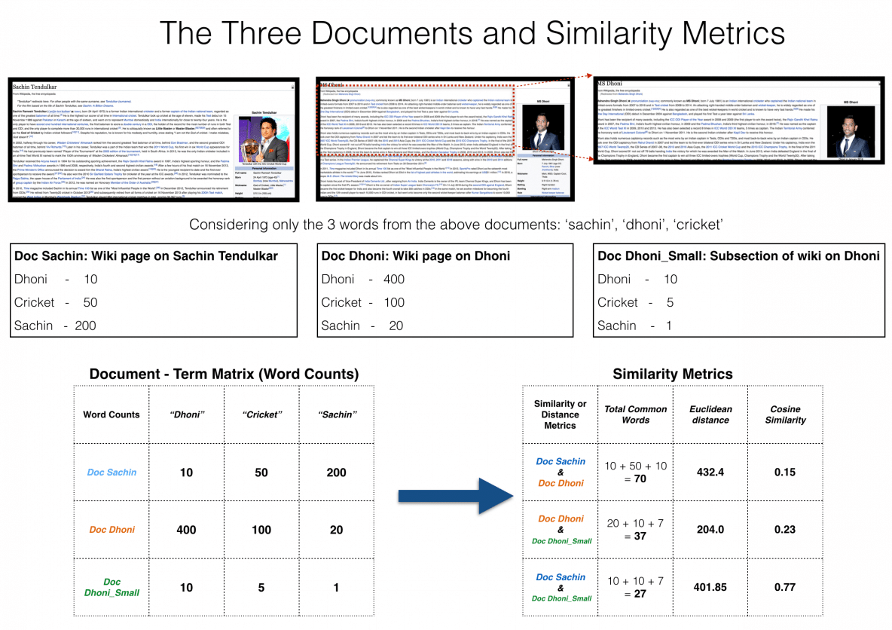

## Cosine Similarity

Cosine similarity is a metric used to measure how similar the documents are irrespective of their size. Mathematically, it measures the cosine of the angle between two vectors projected in a multi-dimensional space. The cosine similarity is advantageous because even if the two similar documents are far apart by the Euclidean distance (due to the size of the document), chances are they may still be oriented closer together. The smaller the angle, higher the cosine similarity.

### Introduction
A commonly used approach to match similar documents is based on counting the maximum number of common words between the documents.

But this approach has an inherent flaw. That is, as the size of the document increases, the number of common words tend to increase even if the documents talk about different topics.

The cosine similarity helps overcome this fundamental flaw in the ‘count-the-common-words’ or Euclidean distance approach.

Cosine-similarity lies between [-1,1].

### What is Cosine Similarity and why is it advantageous?

Cosine similarity is a metric used to determine how similar the documents are irrespective of their size.

Mathematically, it measures the cosine of the angle between two vectors projected in a multi-dimensional space. In this context, the two vectors I am talking about are arrays containing the word counts of two documents.

As a similarity metric, how does cosine similarity differ from the number of common words?

When plotted on a multi-dimensional space, where each dimension corresponds to a word in the document, the cosine similarity captures the orientation (the angle) of the documents and not the magnitude. If you want the magnitude, compute the Euclidean distance instead.

The cosine similarity is advantageous because even if the two similar documents are far apart by the Euclidean distance because of the size (like, the word ‘cricket’ appeared 50 times in one document and 10 times in another) they could still have a smaller angle between them. Smaller the angle, higher the similarity.

### Cosine Similarity Example

Let’s suppose you have 3 documents based on a couple of star cricket players – Sachin Tendulkar and Dhoni. Two of the documents (A) and (B) are from the wikipedia pages on the respective players and the third document (C) is a smaller snippet from Dhoni’s wikipedia page.

As you can see, all three documents are connected by a common theme – the game of Cricket.

Our objective is to quantitatively estimate the similarity between the documents.

For ease of understanding, let’s consider only the top 3 common words between the documents: ‘Dhoni’, ‘Sachin’ and ‘Cricket’.

You would expect Doc A and Doc C, that is the two documents on Dhoni would have a higher similarity over Doc A and Doc B, because, Doc C is essentially a snippet from Doc A itself.

However, if we go by the number of common words, the two larger documents will have the most common words and therefore will be judged as most similar, which is exactly what we want to avoid.

The results would be more congruent when we use the cosine similarity score to assess the similarity.

Let me explain.

Let’s project the documents in a 3-dimensional space, where each dimension is a frequency count of either: ‘Sachin’, ‘Dhoni’ or ‘Cricket’. When plotted on this space, the 3 documents would appear something like this.

As you can see, Doc Dhoni_Small and the main Doc Dhoni are oriented closer together in 3-D space, even though they are far apart by magnitiude.

It turns out, the closer the documents are by angle, the higher is the Cosine Similarity (Cos theta).
Cosine Similarity Formula

$cos \theta$ = $\frac{\overrightarrow{a}.\overrightarrow{b}}{||\overrightarrow{a}||.||\overrightarrow{b}||}$ = $\frac{\sum_{1}^{n} a_{i}b_{i}}{\sqrt{\sum_{1}^{n}a_{i}^2}\sqrt{\sum_{1}^{n}b_{i}^2}}$

where, $\overrightarrow{a}$, $\overrightarrow{b}$ = $\sum_{1}^{n}a_ib_i$ = $a_1b_1 + a_2b_2+...+a_nb_n$ is the dot product of the two vectors.

As you include more words from the document, it’s harder to visualize a higher dimensional space. But you can directly compute the cosine similarity using this math formula.

## Cosine distance

The cosine distance is then defined as

$Cosine Distance=1−Cosine Similarity$

The cosine distance above is defined for positive values only. It is also not a proper distance in that the Schwartz inequality does not hold. However, the following angular definitions are proper distances: 

$angular cosine distance$ = $\frac{1/cosine similarity}{π}$

$angular cosine similarty=1−angular cosine distance$

If negative values are encountered in the input, the cosine distances will not be computed. However, the cosine similarities will be computed. 

Reference 1:- https://www.machinelearningplus.com/nlp/cosine-similarity/
Reference 2:- https://www.itl.nist.gov/div898/software/dataplot/refman2/auxillar/cosdist.htm

