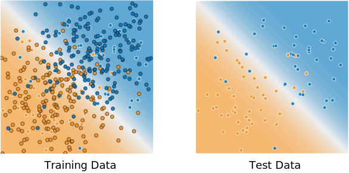

## Training and Test Sets: Splitting Data

The idea of dividing your data set into two subsets:

- **training set**—a subset to train a model.
- **test set**—a subset to test the trained model.

You could imagine slicing the single data set as follows:

Make sure that your test set meets the following two conditions:

- Is large enough to yield statistically meaningful results.
- Is representative of the data set as a whole. In other words, don't pick a test set with different characteristics than the training set.

Assuming that your test set meets the preceding two conditions, your goal is to create a model that generalizes well to new data. Our test set serves as a proxy for new data. For example, consider the following figure. Notice that the model learned for the training data is very simple. This model doesn't do a perfect job—a few predictions are wrong. However, this model does about as well on the test data as it does on the training data. In other words, this simple model does not overfit the training data.

**Never train on test data.** If you are seeing surprisingly good results on your evaluation metrics, it might be a sign that you are accidentally training on the test set. For example, high accuracy might indicate that test data has leaked into the training set.

For example, consider a model that predicts whether an email is spam, using the subject line, email body, and sender's email address as features. We apportion the data into training and test sets, with an 80-20 split. After training, the model achieves 99% precision on both the training set and the test set. We'd expect a lower precision on the test set, so we take another look at the data and discover that many of the examples in the test set are duplicates of examples in the training set (we neglected to scrub duplicate entries for the same spam email from our input database before splitting the data). We've inadvertently trained on some of our test data, and as a result, we're no longer accurately measuring how well our model generalizes to new data.

