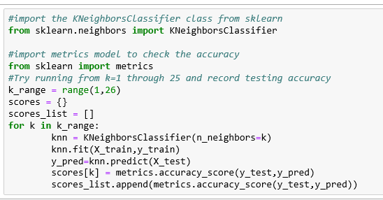

## KNN using scikit-learn

KNN (K-Nearest Neighbor) is a simple supervised classification algorithm we can use to assign a class to new data point. It can be used for regression as well, KNN does not make any assumptions on the data distribution, hence it is non-parametric. It keeps all the training data to make future predictions by computing the similarity between an input sample and each training instance.

**KNN can be summarized as below:**

1. Computes the distance between the new data point with every training example.
2. For computing the distance measures such as Euclidean distance, Hamming distance or Manhattan distance will be used.
3. Model picks K entries in the database which are closest to the new data point.
4. Then it does the majority vote i.e the most common class/label among those K entries will be the class of the new data point.

Below example shows implementation of KNN on iris dataset using scikit-learn library. Iris dataset has 50 samples for each different species of Iris flower(total of 150). For each sample we have sepal length, width and petal length and width and a species name(class/label).

- 150 observations
- 4 features(sepal length, sepal width, petal length, petal width)
- Response variable is the iris species
- Classification problem since response is categorical.

Our task is to build a KNN model which classifies the new species based on the sepal and petal measurements. Iris dataset is available in scikit-learn and we can make use of it build our KNN.

Complete code can be found in the Git Repo.

**Step1: Import the required data and check the features.**

Import the load_iris function form scikit-learen datasets module and create a iris Bunch object(bunch is a scikitlearn’s special object type for storing datasets and its attributes).

Each observation represents one flower and 4 columns represents 4 measurements.We can see the features(measures) under ‘data’ attribute, where as labels under ‘features_names’. As we can see below, labels/responses are encoded as 0,1 and 2. Because the features and repose should be numeric (Numpy arrays) for scikit-learn models and they should have a specific shape.

**Step2: Split the data and Train the Model.**

Training and testing on the same data is not an optimal approach, so we do split the data into two pieces, training set and testing set. We use ‘train_test_split’ function to split the data. Optional parameter ‘test-size’ determines the split percentage. ‘random_state’ parameter makes the data split the same way every time you run. Since we are training and testing on different sets of data, the resulting testing accuracy will be a better estimate of how well the model is likely to perform on unseen data.

Scikit-learn is carefully organized into modules, so that we can import the relevant classes easily. Import the class ‘KNeighborsClassifer’ from ‘neighbors’ module and Instantiate the estimator (‘estimator’ is scikit-learn’s term for a model). We are calling model as estimator because their primary role is to estimate unknown quantities.

In our example we are creating an instance (‘knn’ ) of the class ‘KNeighborsClassifer’, in other words we have created an object called ‘knn’ which knows how to do KNN classification once we provide the data. The parameter ‘n_neighbors’ is the tuning parameter/hyper parameter (k) . All other parameters are set to default values.

‘fit’ method is used to train the model on training data (X_train,y_train) and ‘predict’ method to do the testing on testing data (X_test). Choosing the optimal value of K is critical, so we fit and test the model for different values for K (from 1 to 25) using a for loop and record the KNN’s testing accuracy in a variable (scores).

Plot the relationship between the values of K and the corresponding testing accuracy using the matplotlib library. As we can see there is a raise and fall in the accuracy and it is quite typical when examining the model complexity with the accuracy. In general as the value of K increase there appears to be a raise in the accuracy and again it falls.

In general the Training accuracy rises as the model complexity increases, for KNN the model complexity is determined by the value of K. Larger K value leads to smoother decision boundary (less complex model). Smaller K leads to more complex model (may lead to overfitting). Testing accuracy penalizes models that are too complex(over fitting) or not complex enough(underfit). We get the maximum testing accuracy when the model has right level of complexity, in our case we can see that for a K value of 3 to 19 our model accuracy is 96.6%.

For our final model we can choose a optimal value of K as 5 (which falls between 3 and 19) and retrain the model with all the available data. And that will be our final model which is ready to make predictions.

Reference:- https://towardsdatascience.com/knn-using-scikit-learn-c6bed765be75