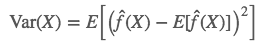
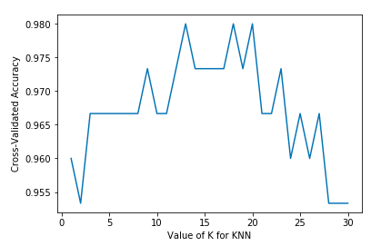

## K-Nearest Neighbors and Bias–Variance Tradeoff

*The k-nearest neighbors algorithm (k-NN) is a non-parametric, lazy learning method used for classification and regression. The output based on the majority vote (for classification) or mean (or median, for regression) of the k-nearest neighbors in the feature space.*

KNN is one of the simplest model since it is non-parametric and lazy learning method. What does it mean? When we say the model is non-parametric, it means that it does not make any assumption of the data distribution. It’s pretty useful in real world application, since most of the data may not follow any distribution. What about lazy learning? Opposed to eager learning, lazy learning is a learning method in which generalization of the training data is delayed until a query is made to the system. In other words, there is no explicit training stage, or it is very minimal, which also means that training is very fast in KNN.

The intuition of KNN is pretty simple. There is an old saying, one takes the behavior of one’s company. Imagine a group of educated, young, and smart people. It’s not hard to imagine that their friend is also the same style, educated, young, and smart.


There are only 3 steps for KNN:

1. Calculate distance (e.g. Euclidean distance, Hamming distance, etc.)
2. Find k closest neighbors
3. Vote for labels or calculate the mean


Pretty easy, right? Now the problem is, what is K? How do we choose K?


### Bias–Variance Tradeoff

Before we choose K, I want to explain an important concept in machine learning, bias-variance tradeoff. First of all, what is bias? And what is variance?

*The bias is an error from erroneous assumptions in the learning algorithm. High bias can cause an algorithm to miss the relevant relations between features and target outputs. In other words, model with high bias pays very little attention to the training data and oversimplifies the model.*

*The variance is an error from sensitivity to small fluctuations in the training set. High variance can cause an algorithm to model the random noise in the training data, rather than the intended outputs. In other words, model with high variance pays a lot of attention to training data and does not generalize on the data which it hasn’t seen before.*

More specifically, we use mathematical terms to define bias and variance. Again, if you are not comfortable with math, you can skip this. I’ll explain by graph in the next paragraph.




Bias is the difference between the true label and our prediction, and variance is defined in Statistics, the expectation of the squared deviation of a random variable from its mean. Here, f represents the model in true world. There exists random noise that we could not avoid, which we represent ϵ. The true label is represented by

$y = f(X) + ϵ$

And we can compute the error.


Let’s use a graph to explain. Imagine that the center of the target (red part) is the correct values of the data. As we move away from that region, the error becomes larger and larger. In this case, we get higher bias. Now imagine we get a number of separate predictions, which may be based on the variability in the training data. In this case, we get a higher variance.


There are other two terms related to bias and variance, **underfitting** and **overfitting**. **Underfitting** means the model does not fit, in other words, does not predict, the (training) data very well. On the other hand, **overfitting** means that the model predict the (training) data too well. It is too good to be true. If the new data point comes in, the prediction may be wrong. Normally, underfitting implies high bias and low variance, and overfitting implies low bias but high variance.

Dealing with bias-variance problem is about dealing with over- and under-fitting. Bias is reduced and variance is increased in relation to model complexity. Why? If the model is more complex, it means it has more power to capture the distribution of the data, which fits in the training set perfectly, in other word, overfitting.


Now we have another problem. How do we know if we are under- or over-fitting? In real world application, we would not know the ground truth of the test set. How do we compute the error if we don’t know the answer?

### Cross-validation

The answer is pretty simple, just split the training set. Say we want to split the training set to A (80% of data) and B (20% of data). We then train our model based on A and test the model on B, since we know the ground truth of B now. B is called the validation set. We could use the validation set to tune our parameters, such as K in KNN. Remember that we could not use the ground truth of the validation set when we are training. We could use a more stable method called cross-validation to test the result. We rotate our validation set and use the rest of the data to train, say, split the data into K fold, and train on (K–1) folds and test on 1 fold as validation set, which is called K-fold cross validation. After that, we average all the errors to get the final accuracy.


When K equals to the number of training set, it’s called Leave-one-out CV, since we only test on one sample each time and use the rest of the data to train.

### Back to KNN

Let’s go back to KNN, how do the bias and variance relate to KNN? I just say that KNN is lazy learning at the beginning, how does it relate to model complexity? Now, consider an extreme case, K=1, what will it happen? The training data will be perfectly predicted, right? The bias will be 0 when K=1, however, when it comes to new data (in test set), it has higher chance to be an error, which causes high variance. When we increase K, the training error will increase (increase bias), but the test error may decrease at the same time (decrease variance). We can think that when K becomes larger, since it has to consider more neighbors, its model is more complex. Now we can split the data into training and validation set and decide what K should be like.


### When K=1(overfitting) and K=20(underfitting)

To find out how to color the regions within these boundaries, for each point we look to the neighbor's color. When K=1, for each data point, x, in our training set, we want to find one other point, x′, that has the least distance from x. The shortest possible distance is always 0, which means our "nearest neighbor" is actually the original data point itself, $x=x′$.

To color the areas inside these boundaries, we look up the category corresponding each x. Let's say our choices are blue and red. With K=1, we color regions surrounding red points with red, and regions surrounding blue with blue. The result would look something like this:


Notice how there are no red points in blue regions and vice versa. That tells us there's a training error of 0.

Note that decision boundaries are usually drawn only between different categories, (throw out all the blue-blue red-red boundaries) so your decision boundary might look more like this:


Again, all the blue points are within blue boundaries and all the red points are within red boundaries; we still have a test error of zero. On the other hand, if we increase K to K=20, we have the diagram below. Notice that there are some red points in the blue areas and blue points in red areas. This is what a non-zero training error looks like.

When K=20, we color color the regions around a point based on that point's category (color in this case) and the category of 19 of its closest neighbors. If most of the neighbors are blue, but the original point is red, the original point is considered an outlier and the region around it is colored blue. That's why you can have so many red data points in a blue area an vice versa. 


### Programming it

We use Iris dataset to train our model. It has 3 classes which represent 3 different kinds of iris. Our goal is to classify which iris it is.


There are 4 features in this dataset. We do a little bit data exploration. It seems that we can separate the class by only 2 features. However, since we want to see how K affects the result, we choose feature 1 and 2 because it has more overlap.


We can build our model now! Remember, KNN does not have training step, so we predict the data directly. There are 3 steps for KNN, calculate the distance, find K nearest neighbors, and count the number of each label.

```python
def KNNModel(Xtr, Ytr, K, Xte):
    Xtr = np.asarray(Xtr)
    Ytr = np.asarray(Ytr)
    classes = list(np.unique(Ytr))
    
    mtr, ntr = np.asarray(Xtr).shape
    mte, nte = np.asarray(Xte).shape
    num_class = len(classes)
    Yte = np.tile(Ytr[0], (mte, 1)) 
    
    K = min(K, mtr)    # can't use more neighbors than training set
    
    for i in range(mte):    # for each sample
        # calculate the distance, we use Euclidean distance here
        dist = np.sum(np.power(Xtr - np.asarray(Xte)[i, :], 2), axis=1)
        # find K nearest neighbors
        K_nearest_idx = np.argsort(dist, axis=0)[0:K]
        sorted_dist = dist[K_nearest_idx]
        # count the number of each label
        count = np.zeros((num_class,))
        for c in range(num_class):
            count[c] = np.sum(Ytr[K_nearest_idx] == classes[c])
        c_max = np.argmax(count)
        Yte[i] = classes[c_max]
    return Yte
```

We test different K and visualize the decision boundary.


We can see that when K is small, there are some outliers of green label are still green, and outliers of red label are still red. When K becomes larger, the boundary is more consistent and reasonable.

Second, we use sklearn built-in KNN model and test the cross-validation accuracy. There is only one line to build the model.

```python
knn = KNeighborsClassifier(n_neighbors=k)
```

And one line for cross-validation test.

```python
cross_val_score(knn_model, X, y, cv=k-fold, scoring='accuracy')
```

The result shows that we could choose K around 13 or 20, which we’ll get the highest cross-validation accuracy.



### Pros and cons of KNN

And few pros and cons about KNN.

Pros:

- No assumptions about data distribution, useful in real world application
- Simple algorithm to explain and understand
- It can use for both classification and regression

Cons:

- Computationally expensive, because the algorithm stores all of the training data
- High memory requirement, again, it stores all of the training data
- Prediction stage might be slow (with big N)


Reference 1:- https://medium.com/30-days-of-machine-learning/day-3-k-nearest-neighbors-and-bias-variance-tradeoff-75f84d515bdb

Reference 2:- https://stats.stackexchange.com/questions/367010/training-error-in-knn-classifier-when-k-1/367015


