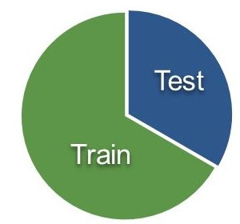
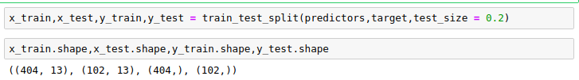
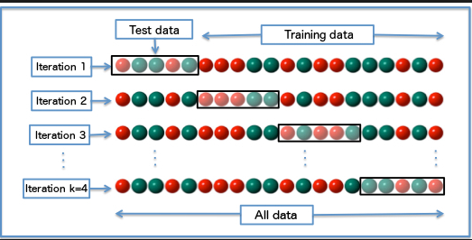
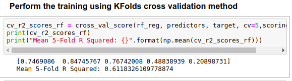
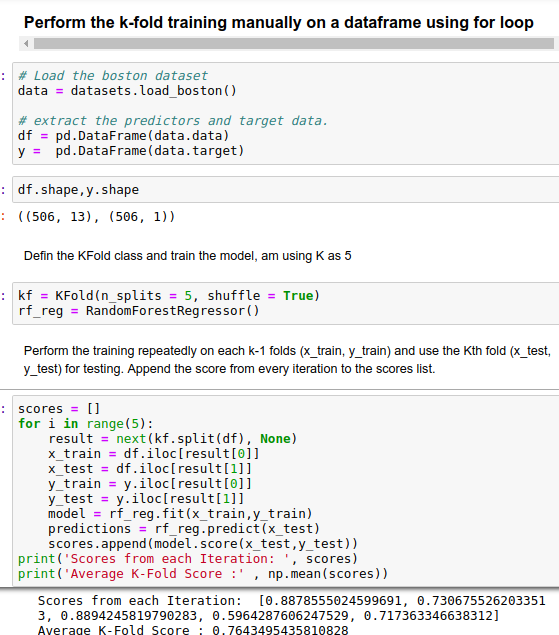

## Why and how to Cross Validate a Model?

Once we are done with training our model, we just can’t assume that it is going to work well on data that it has not seen before. In other words, we cant be sure that the model will have the desired accuracy and variance in production environment. We need some kind of assurance of the accuracy of the predictions that our model is putting out. For this, we need to validate our model. This process of deciding whether the numerical results quantifying hypothesised relationships between variables, are acceptable as descriptions of the data, is known as validation.

To evaluate the performance of any machine learning model we need to test it on some unseen data. Based on the models performance on unseen data we can say weather our model is Under-fitting/Over-fitting/Well generalised. **Cross validation (CV)** is one of the technique used to test the effectiveness of a machine learning models, it is also a re-sampling procedure used to evaluate a model if we have a limited data. To perform CV we need to keep aside a sample/portion of the data on which is do not use to train the model, later us this sample for testing/validating. There are many methods.

Below are the few common techniques used for CV.

1. Train_Test Split approach.
   
   In this approach we randomly split the complete data into training and test sets. Then Perform the model training on the training set and use the test set for validation purpose, ideally split the data into 70:30 or 80:20. With this approach there is a possibility of high bias if we have limited data, because we would miss some information about the data which we have not used for training. If our data is huge and our test sample and train sample has the same distribution then this approach is acceptable.

   

   We can manually split the data into train and test set using slicing or we can use the train_test_split of scikit-learn method for this task.

   

2. K-Folds Cross Validation
   
   K-Fold is a popular and easy to understand, it generally results in a less biased model compare to other methods. Because it ensures that every observation from the original dataset has the chance of appearing in training and test set. This is one among the best approach if we have a limited input data. This method follows the below steps.

   

   - Split the entire data randomly into k folds (value of k shouldn’t be too small or too high, ideally we choose 5 to 10 depending on the data size). The higher value of K leads to less biased model (but large variance might lead to overfit), where as the lower value of K is similar to the train-test split approach we saw before.
   - Then fit the model using the K — 1 (K minus 1) folds and validate the model using the remaining Kth fold. Note down the scores/errors.
   - Repeat this process until every K-fold serve as the test set. Then take the average of your recorded scores. That will be the performance metric for the model.

   We can write a logic manually to perform this or we can use the built in cross_val_score (returns score of each test folds)/corss_val_predict (returns the predicted score for each observation in the input dataset when it was part of the test set) from the scikit_learn library.

   If the esitmator (model) is a claissifier and ‘y’(target variable) is either binary/multicalss, then ‘StratifiedKfold’ technique is used by default. In all other cases ‘K_Fold’ technique is used as a default to split and train the model.

    

    Similar to K_Fold cross-validator, StratifiedKfold returns stratified folds, i.e while making the folds it maintains the percentage of samples for each class in every fold. So that model gets equally distributed data for training/test folds.

    We can use the folds from K-Fold as an iterator and use it in a for loop to perform the training on a pandas dataframe. Below is the example. 

    

Reference:- https://towardsdatascience.com/why-and-how-to-cross-validate-a-model-d6424b45261f
