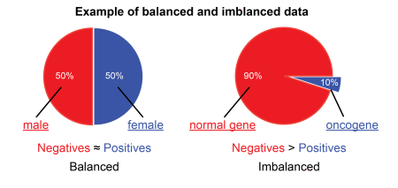
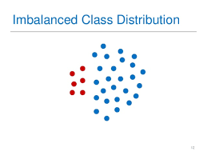
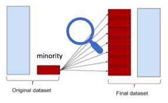
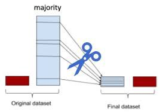
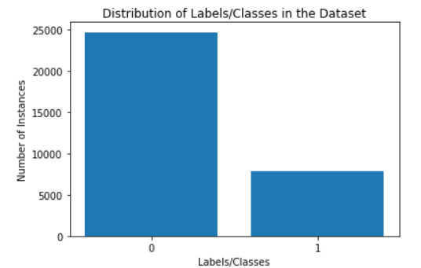
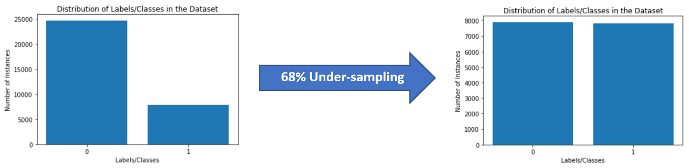
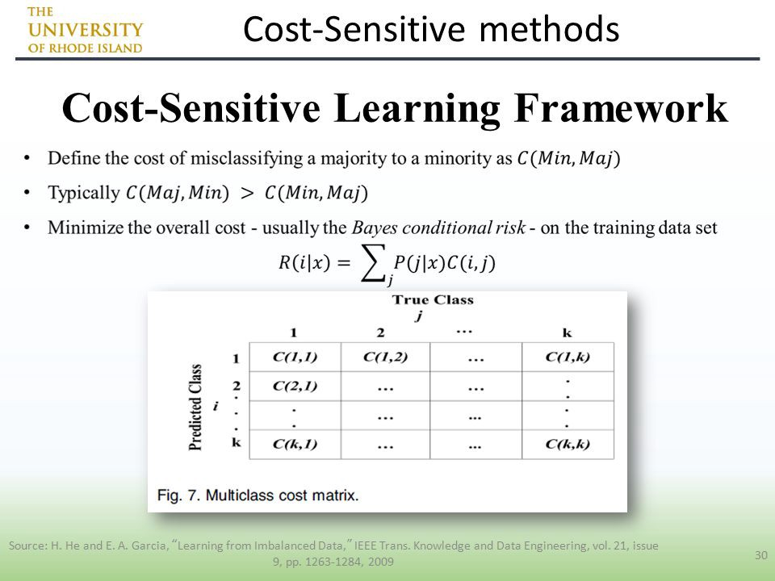
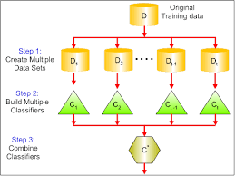

## Imbalanced vs Balanced Dataset

### What Is Balanced And Imbalanced Dataset?

“Everyone wants to be perfect. So why our dataset should not be perfect? Let’s make it perfect”

What we will be covering in this article

- Problem with an Imbalanced Dataset.
- What Is Balanced and Imbalanced Dataset?
- Techniques to Convert Imbalanced Dataset into Balanced Dataset.
- Conclusion and future scope.

So Let’s Start: -

### Problem with an Imbalanced Datasets

Let’s say you are working in a leading tech company and company is giving you a task to train a model on detecting the fraud detection. But here’s the catch. The fraud transaction is relatively rare;

So you start to training you model and get over 95% accuracy.

You feel good and present your model in front of company CEO’s and Share Holders.

When they give inputs to your model so your model is predicting “Not a Fraud Transaction” every time.

This is clearly a problem because many machine learning algorithms are designed to maximize overall accuracy.

Now what happen?? You get 95% accuracy but your model in predicting wrong every time??

Let’s find out why?

### What are Balanced and Imbalanced Datasets?

**Balanced Dataset:—** Let’s take a simple example if in our data set we have positive values which are approximately same as negative values. Then we can say our dataset in balance

Consider Orange color as a positive values and Blue color as a Negative value. We can say that the number of positive values and negative values in approximately same.

**Imbalanced Dataset:—** If there is the very high different between the positive values and negative values. Then we can say our dataset in Imbalance Dataset.

In 2-class classification, Lets say we have dataset $D_{n}$ which has $n_{1}$ +ve points and $n_{2}$ -ve points. If $n_{1} \approx n_{2}$, then the dataset is said to be balanced dataset and if $n_{1} >> n_{2}$ or $n_{1} << n_{2}$, then the dataset is said to be imbalanced dataset. 

### Techniques to Convert Imbalanced Dataset into Balanced Dataset

Imbalanced data is not always a bad thing, and in real data sets, there is always some degree of imbalance. That said, there should not be any big impact on your model performance if the level of imbalance is relatively low.

Now, let’s cover a few techniques to solve the class imbalance problem.

### Use the right evaluation metrics:

Evaluation metrics can be applied such as:

- **Confusion Matrix:** a table showing correct predictions and types of incorrect predictions.
- **Precision:** the number of true positives divided by all positive predictions. Precision is also called Positive Predictive Value. It is a measure of a classifier’s exactness. Low precision indicates a high number of false positives.
- **Recall:** the number of true positives divided by the number of positive values in the test data. Recall is also called Sensitivity or the True Positive Rate. It is a measure of a classifier’s completeness. Low recall indicates a high number of false negatives.
- **F1-Score:** the weighted average of precision and recall. 
  
  
#### Over-sampling (Up Sampling)

This technique is used to modify the unequal data classes to create balanced datasets. When the quantity of data is insufficient, the oversampling method tries to balance by incrementing the size of rare samples.

(Or)

Over-sampling increases the number of minority class members in the training set. The advantage of over-sampling is that no information from the original training set is lost, as all observations from the minority and majority classes are kept. On the other hand, it is prone to over fitting.

Example: We have 1000 data in dataset $D_{n}$ out of which 900 are -ve points and 100 are +ve points. As we can see that the data is imbalanced. To fix this issue, here I will use oversampling which means I will simply repeat +ve points 9 times to make it approximately equal to the -ve points. This will make the dataset balanced. This is one way of oversampling. There are others as well for example we can create synthetic/artificial points using extrapolation.

**Advantages**

- No loss of information
- Mitigate overfitting caused by oversampling.

**Disadvantages**

- Overfitting

#### Under-sampling (Down Sampling)

Unlike oversampling, this technique balances the imbalance dataset by reducing the size of the class which is in abundance. There are various methods for classification problems such as cluster centroids and Tomek links. The cluster centroid methods replace the cluster of samples by the cluster centroid of a K-means algorithm and the Tomek link method removes unwanted overlap between classes until all minimally distanced nearest neighbors are of the same class.

(Or)

Under-sampling, on contrary to over-sampling, aims to reduce the number of majority samples to balance the class distribution. Since it is removing observations from the original data set, it might discard useful information.

Example:- 

Here, label 0 contains 24,720 instances while label 1 contains only 7841 instances. This is an example of Binary (as there are 2 labels, 0 & 1) Imbalanced Data. This Imbalance can be reduced to a great extent by Under-sampling the majority class, label 0 and making it close to that of label 1.

**DATA IMBALANCE REMOVAL**

The Imbalanced Nature of the data is shown in above fig. It contains 24,720 ‘0’ labelled (majority) instances and 7841 ‘1’ labelled (minority) instances. This Data Imbalance is removed using Cluster Centroid based Majority Under-sampling Technique (CCMUT), in which the majority class (label 0) is 68% under-sampled. The reduction in Data Imbalance after 68% Under-sampling is shown below fig.

**SHUFFLING AND SPLITTING**

The resulting dataset contains 7911 ‘0’ labelled instances and 7841 ‘1’ labelled instances. The whole dataset is shuffled in a consistent way and 80–20 split (80% Training Set and 20% Validation Set).

**Advantages**

- Run-time can be improved by decreasing the amount of training dataset.
- Helps in solving the memory problems

**Disadvantages**

- Losing some critical information
- Throwing away data when undersampling
- Model has smaller amount of data

#### Class Weights

xample: We have 1000 data in dataset $D_{n}$ out of which 900 are -ve points and 100 are +ve points. As we can see that the data is imbalanced. To fix this issue, here I will use class weights. What I mean by that is I will give more weight to the minority class(+ve) and less weight to the majority class(-ve). 

${w_{+}}$ : 9 -> more weight to the minority class

${w_{-}}$ : 1 -> less weight to the majority class

#### Feature selection

In order to tackle the imbalance problem, we calculate the one-sided metric such as correlation coefficient (CC) and odds ratios (OR) or two-sided metric evaluation such as information gain (IG) and chi-square (CHI) on both the positive class and negative class. Based on the scores, we then identify the significant features from each class and take the union of these features to obtain the final set of features. Then, we use this data to classify the problem.

Identifying these features will help us generate a clear decision boundary with respect to each class. This helps the models to classify the data more accurately. This performs the function of intelligent subsampling and potentially helps reduce the imbalance problem.

#### Cost-Sensitive Learning Technique

The Cost-Sensitive Learning (CSL) takes the misclassification costs into consideration by minimising the total cost. The goal of this technique is mainly to pursue a high accuracy of classifying examples into a set of known classes. It is playing as one of the important roles in the machine learning algorithms including the real-world data mining applications.

**Advantages:**

- This technique avoids pre-selection of parameters and auto-adjust the decision hyperplane

#### Ensemble Learning Techniques

The ensemble-based method is another technique which is used to deal with imbalanced data sets, and the ensemble technique is combined the result or performance of several classifiers to improve the performance of single classifier. This method modifies the generalisation ability of individual classifiers by assembling various classifiers. It mainly combines the outputs of multiple base learners. There are various approaches in ensemble learning such as Bagging, Boosting, etc.

**Advantages**

- This is a more stable model
- The prediction is better

### Conclusion

Imbalanced data is one of the potential problems in the field of data mining and machine learning. This problem can be approached by properly analyzing the data. A few approaches that help us in tackling the problem at the data point level are undersampling, oversampling, and feature selection. Moving forward, there is still a lot of research required in handling the data imbalance problem more efficiently. 

*Note: Always prefer oversampling over undersampling*

Reference 1:- https://medium.com/analytics-vidhya/what-is-balance-and-imbalance-dataset-89e8d7f46bc5

Reference 2:- https://towardsdatascience.com/under-sampling-a-performance-booster-on-imbalanced-data-a79ff1559fab

