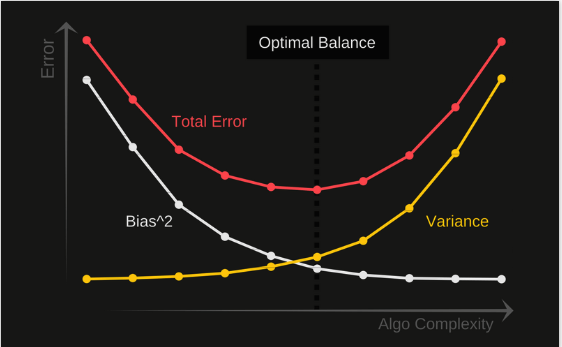

## Understanding the Bias-Variance Tradeoff(https://en.wikipedia.org/wiki/Bias%E2%80%93variance_tradeoff)

Whenever we discuss model prediction, it’s important to understand prediction errors (bias and variance). There is a tradeoff between a model’s ability to minimize bias and variance. Gaining a proper understanding of these errors would help us not only to build accurate models but also to avoid the mistake of overfitting and underfitting.

So let’s start with the basics and see how they make difference to our machine learning Models.

### What is bias?

Bias is the difference between the average prediction of our model and the correct value which we are trying to predict. Model with high bias pays very little attention to the training data and oversimplifies the model. It always leads to high error on training and test data.

High bias can cause an algorithm to miss the relevant relations between features and target outputs (underfitting). It means model is very bais towards simplifying assumptions.

### What is variance?

Variance is the variability of model prediction for a given data point or a value which tells us spread of our data. Model with high variance pays a lot of attention to training data and does not generalize on the data which it hasn’t seen before. As a result, such models perform very well on training data but has high error rates on test data. 

High variance can cause an algorithm to model the random noise in the training data, rather than the intended outputs (overfitting). It means small changes in training dataset result in very different model.

### Mathematically

Let the variable we are trying to predict as Y and other covariates as X. We assume there is a relationship between the two such that

$Y = f(X) + e$

Where e is the error term and it’s normally distributed with a mean of 0.

We will make a model f^(X) of f(X) using linear regression or any other modeling technique.

So the expected squared error at a point x is

$Err(x)=E[(Y - \hat{f}(x))^2]$

The $Err(x)$ can be further decomposed as

$Err(x)=(E[\hat{f}(x)] - f(x))^2 + E[(\hat{f}(x) - E[\hat{f}(x)])^2] + \sigma_{e}^2$

$Err(x)=Bias^2+Variance+Irreducible Error$

$Err(x)$ is the sum of $Bias^2$, variance and the irreducible error(error that you cannot reduce further for a given model).

$Err(x)$ is also called as generalization error.

Irreducible error is the error that can’t be reduced by creating good models. It is a measure of the amount of noise in our data. Here it is important to understand that no matter how good we make our model, our data will have certain amount of noise or irreducible error that can not be removed.

- $Generalization Error \downarrow = Bias^2 \downarrow +Variance \downarrow+Irreducible Error$
- $Bias^2 \downarrow \rightarrow$ No underfit
- $Variance \downarrow \rightarrow$ No overfit
- When $K=1$, $Bias \downarrow$, $Variance \uparrow$
- When $K \uparrow$, $Bias \uparrow$ slightly, $Variance \downarrow$ drastically
- When $K \rightarrow n$, $Bias$ very $\uparrow$, $Variance$ very $\downarrow$ 

### Bias and variance using bulls-eye diagram

In the above diagram, center of the target is a model that perfectly predicts correct values. As we move away from the bulls-eye our predictions become get worse and worse. We can repeat our process of model building to get separate hits on the target.

In supervised learning, underfitting happens when a model unable to capture the underlying pattern of the data. These models usually have high bias and low variance. It happens when we have very less amount of data to build an accurate model or when we try to build a linear model with a nonlinear data. Also, these kind of models are very simple to capture the complex patterns in data like Linear and logistic regression.

In supervised learning, overfitting happens when our model captures the noise along with the underlying pattern in data. It happens when we train our model a lot over noisy dataset. These models have low bias and high variance. These models are very complex like Decision trees which are prone to overfitting.

### Why is Bias Variance Tradeoff?

If our model is too simple and has very few parameters then it may have high bias and low variance. On the other hand if our model has large number of parameters then it’s going to have high variance and low bias. So we need to find the right/good balance without overfitting and underfitting the data.

This tradeoff in complexity is why there is a tradeoff between bias and variance. An algorithm can’t be more complex and less complex at the same time.

### Total Error

To build a good model, we need to find a good balance between bias and variance such that it minimizes the total error.

$Total Error=Bias^2+Variance+Irreducible Error$

An optimal balance of bias and variance would never overfit or underfit the model.

Therefore understanding bias and variance is critical for understanding the behavior of prediction models.

### Intuitive Understanding

Dataset $D$ is divided into $D_{Train}$ and $D_{Test}$. $D_{Train}$ has $(x_i, y_i)$. I build a model using training data. 

$x_i \rightarrow Model \rightarrow \hat{y_i}$

Using this model I can compute train error and test error,

$Train-error = diff(y_i, \hat{y_i})_{training-data}$

$Test-error = diff(y_i, \hat{y_i})_{test-data}$

1. High bias or underfitting

If training error is high, bias in model is high.

If training error is low, bias in model is low.

2. High Variance or overfitting

If training error is low and test error is high, variance in model is high.

If training data changes slightly, if the model changes, then the model has high variance.
 

Reference:- http://scott.fortmann-roe.com/docs/BiasVariance.html