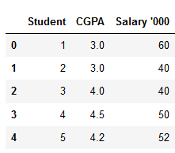
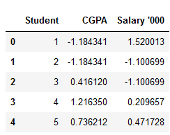

## Feature Scaling and Column Standarization

### Introduction to Feature Scaling

I was recently working with a dataset that had multiple features spanning varying degrees of magnitude, range, and units. This is a significant obstacle as a few machine learning algorithms are highly sensitive to these features.

I’m sure most of you must have faced this issue in your projects or your learning journey. For example, one feature is entirely in kilograms while the other is in grams, another one is liters, and so on. How can we use these features when they vary so vastly in terms of what they’re presenting?

    This is where I turned to the concept of feature scaling. It’s a crucial part of the data preprocessing stage but I’ve seen a lot of beginners overlook it (to the detriment of their machine learning model).

Here’s the curious thing about feature scaling – it improves (significantly) the performance of some machine learning algorithms and does not work at all for others. What could be the reason behind this quirk?

Also, what’s the difference between normalization and standardization? These are two of the most commonly used feature scaling techniques in machine learning but a level of ambiguity exists in their understanding. When should you use which technique?

### Distance-Based Algorithms

Distance algorithms like KNN, K-means, and SVM are most affected by the range of features. This is because behind the scenes they are using distances between data points to determine their similarity.

For example, let’s say we have data containing high school CGPA scores of students (ranging from 0 to 5) and their future incomes (in thousands Rupees):

Since both the features have different scales, there is a chance that higher weightage is given to features with higher magnitude. This will impact the performance of the machine learning algorithm and obviously, we do not want our algorithm to be biassed towards one feature.

    Therefore, we scale our data before employing a distance based algorithm so that all the features contribute equally to the result.

The effect of scaling is conspicuous when we compare the Euclidean distance between data points for students A and B, and between B and C, before and after scaling as shown below:

- Distance AB before scaling => $\sqrt{(40-60)^2 + (3-3)^2} = 20$
- Distance BC before scaling => $\sqrt{(40-40)^2 + (4-3)^2} = 1$
- Distance AB after scaling => $\sqrt{(1.1+1.5)^2 + (1.18-1.18)^2} = 2.6$
- Distance BC after scaling => $\sqrt{(1.1-1.1)^2 + (0.41+1.18)^2} = 1.59$

Scaling has brought both the features into the picture and the distances are now more comparable than they were before we applied scaling.

### What is Normalization?

Normalization is a scaling technique in which values are shifted and rescaled so that they end up ranging between 0 and 1. It is also known as Min-Max scaling.

Here’s the formula for normalization:

$X'=\frac{X-X_{min}}{X_{max}-X_{min}}$

Here, $X_{max}$ and $X_{min}$ are the maximum and the minimum values of the feature respectively.

- When the value of X is the minimum value in the column, the numerator will be 0, and hence X’ is 0
- On the other hand, when the value of X is the maximum value in the column, the numerator is equal to the denominator and thus the value of X’ is 1
- If the value of X is between the minimum and the maximum value, then the value of X’ is between 0 and 1

### What is Standardization?

Standardization is another scaling technique where the values are centered around the mean with a unit standard deviation. This means that the mean of the attribute becomes zero and the resultant distribution has a unit standard deviation.

Here’s the formula for standardization:

$X'=\frac{X-\mu}{\sigma}$

Feature scaling: $\mu$ is the mean of the feature values and Feature scaling: $\sigma$ is the standard deviation of the feature values. Note that in this case, the values are not restricted to a particular range.

Now, the big question in your mind must be when should we use normalization and when should we use standardization? Let’s find out!

### The Big Question – Normalize or Standardize?

Normalization vs. standardization is an eternal question among machine learning newcomers. Let me elaborate on the answer in this section.

- Normalization is good to use when you know that the distribution of your data does not follow a Gaussian distribution. This can be useful in algorithms that do not assume any distribution of the data like K-Nearest Neighbors and Neural Networks.
- Standardization, on the other hand, can be helpful in cases where the data follows a Gaussian distribution. However, this does not have to be necessarily true. Also, unlike normalization, standardization does not have a bounding range. So, even if you have outliers in your data, they will not be affected by standardization.

However, at the end of the day, the choice of using normalization or standardization will depend on your problem and the machine learning algorithm you are using. There is no hard and fast rule to tell you when to normalize or standardize your data. You can always start by fitting your model to raw, normalized and standardized data and compare the performance for best results.

Reference:- https://www.analyticsvidhya.com/blog/2020/04/feature-scaling-machine-learning-normalization-standardization/