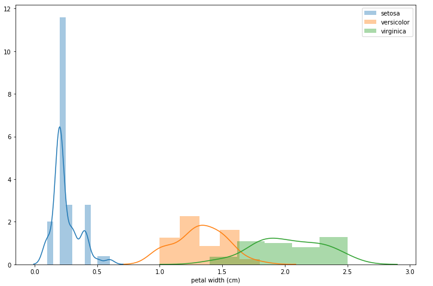
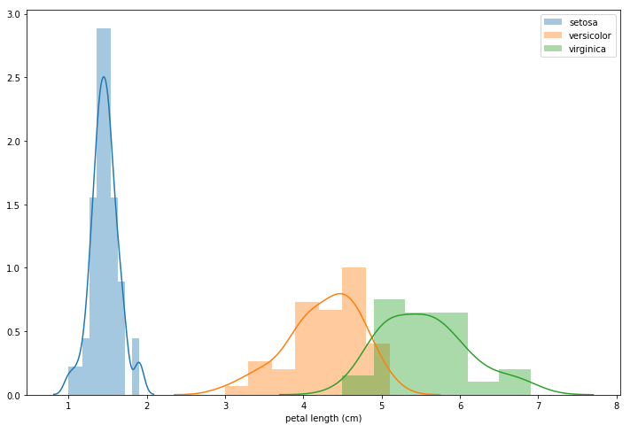

## Feature importance and feature selection

Processing of high dimensional data can be very challenging. By “high” it is meant thousands of dimensions, try to imagine(even though you can’t) a 70k dimensional space. Algorithms which rely on Euclidean distance as the measure of distance between 2 points start breaking down. This is referred to as the curse of dimensionality. Models such as K Nearest Neighbors and Linear Regression can easily overfit to high dimensional data and thus require careful hyperparameter tuning. Thus dimensionality reduction can be quite advantageous for any predictive model. However one cannot just throw away features randomly, after all, it is data which is the new oil. Dimensionality reduction techniques have been developed which not only facilitate extraction of discriminating features for data modeling but also help in visualizing high dimensional data in 2D, 3D or nD(if you can visualize it) space by transforming high dimensional data into low dimensional embeddings while preserving some fraction of originally available information. In case of PCA, this information is contained in the variance of extracted features whereas TSNE(T distributed stochastic neighborhood embedding) tries to preserve neighborhood information for as many points as it can, based on perplexity of the model. TSNE is state-of-the-art technique presently available.

The focus of this post is selection of the most discriminating subset of features for classification problems based on KPI of choice. Classification accuracy is chosen to be the KPI for explanation purposes. I will be using the “hello world” dataset of machine learning, you guessed it right, the very famous Iris dataset.

The dataset consists of 150 rows and 4 columns. It is a balanced dataset with 50 instances each of Iris-Setosa, Iris-Virginica, and Iris-Versicolor. If we look at the distribution of petal length and petal width for the three classes, we find something very interesting.





Clearly, these 2 are very good discriminators for separating Setosa from Versicolor and Virginica. We would like to find the most important features for accurately predicting the class of an input flower.

To solve this problem we will be employing a technique called forward [feature selection](https://en.wikipedia.org/wiki/Feature_selection). This reduction in features offers the following benefits

- Reduced training times
- Simplified and interpretable models
- Reduced chances of overfitting i.e. lesser variance
- Less impact of the curse of dimensionality

The code for forward feature selection looks somewhat like this

```python
# Input : Dataframe df with m features, number of required features n
# Output : Set of n features most useful for model performance

def forward_feature_selection(x_train, x_cv, y_train, y_cv, n):
    feature_set = []
    for num_features in range(n):
        metric_list = [] # Choose appropriate metric based on business problem
        model = SGDClassifier() # You can choose any model you like, this technique is model agnostic
        for feature in x_train.columns:
            if feature not in feature_set:
                f_set = feature_set.copy()
                f_set.append(feature)
                model.fit(x_train[f_set], y_train)
                metric_list.append((evaluate_metric(model, x_cv[f_set], y_cv), feature))

        metric_list.sort(key=lambda x : x[0], reverse = True) # In case metric follows "the more, the merrier"
        feature_set.append(metric_list[0][1])
    return feature_set
```

The code is pretty straightforward. First, we have created an empty list to which we will be appending the relevant features. We start by selecting one feature and calculating the metric value for each feature on cross-validation dataset. The feature offering best metric value is selected and appended to list of features. The process is reiterated, this time with two features, one selected from the previous iteration and the other one selected from the set of all features not present in the set of already chosen features. The metric value is computed for each set of 2 features and feature offering best metric value is appended to the list of relevant features. This process is repeated until we have the desired number of features (n in this case). Thus we can look at the feature set as a hyperparameter. Forward feature selection allows us to tune this hyperparameter for optimal performance.

Enough with the theory, let us see if this algorithm aligns with our observations about iris dataset. Just to recall, petal dimensions are good discriminators for separating Setosa from Virginica and Versicolor flowers. We arrange the four features in descending order of their importance and here are the results when f1_score is chosen as the KPI

```python
from sklearn.linear_model import SGDClassifier
from sklearn.model_selection import train_test_split
from sklearn.metrics import f1_score

x_train, x_cv, y_train, y_cv=train_test_split(df, target, test_size=0.2, stratify=target)

def evaluate_metric(model, x_cv, y_cv):
    return f1_score(y_cv, model.predict(x_cv), average='micro')

def forward_feature_selection(x_train, x_cv, y_train, y_cv, n):
    feature_set = []
    for num_features in range(n):
        metric_list = [] # Choose appropriate metric based on business problem
        model = SGDClassifier() # You can choose any model you like, this technique is model agnostic
        for feature in x_train.columns:
            if feature not in feature_set:
                f_set = feature_set.copy()
                f_set.append(feature)
                model.fit(x_train[f_set], y_train)
                metric_list.append((evaluate_metric(model, x_cv[f_set], y_cv), feature))

        metric_list.sort(key=lambda x : x[0], reverse = True) # In case metric follows "the more, the merrier"
        feature_set.append(metric_list[0][1])
    return feature_set

f=forward_feature_selection(x_train, x_cv, y_train, y_cv, 4)
print(f)
```

Output of above program is

    ['petal width (cm)',
    'petal length (cm)',
    'sepal width (cm)',
    'sepal length (cm)']

Voila! Results are in perfect alignment with our observation. As mentioned in the code, this technique is model agnostic and can be used for evaluating feature importance for any classification/regression model.

What about the time complexity? It’s fairly obvious that it depends on the model being used. Linear models take less time to train than non-linear models. For the sake of simplicity assume that it takes linear time to train a model (linear in the number of rows). This assumption is correct in case of small m. If there are r rows in a dataset, the time taken to run above algorithm will be

$T=mr+mlog(m)+(m-1)r+(m-1)log(m-1)+(m-2)r+(m-2)log(m-2)+...+(m-n+1)r+(m-n+1)log(m-n+1)$

which simplifies to

$nmr+m\log{\frac{m!}{(m-n)!}}-r \times \frac{(n-1)n}{2}$

We can observe that although reliable, this method takes a considerable amount of time to run.

That’s all for forward feature selection. If you know better techniques to extract valuable features, do let me know in the comments section below.

- In the forward method, the software looks at all the predictor variables you selected and picks the one that predicts the most on the dependent measure. That variable is added to the model. This is repeated with the variable that then predicts the most on the dependent measure. This little procedure continues until adding predictors does not add anything to the prediction model anymore. The most significant of these feature is added to the model, so long as it's P-value is below some pre-set level i.e., 0.05. Forward selection has drawbacks, including the fact that each addition of a new feature may render one or more of the already included feature non-significant (p-value>0.05). 
- In the backward method, all the predictor variables you chose are added into the model. Then, the variables that do not (significantly) predict anything on the dependent measure are removed from the model one by one(drop the least significant feature (p-value<0.05), so long as it is not significant at our chosen critical level). The backward method is generally the preferred method, because the forward method produces so-called suppressor effects. These suppressor effects occur when predictors are only significant when another predictor is held constant.

### Steps of Backward Elimination

Below are some main steps which are used to apply backward elimination process:

Step-1: Firstly, We need to select a significance level to stay in the model. (SL=0.05)

Step-2: Fit the complete model with all possible predictors/independent variables.

Step-3: Choose the predictor which has the highest P-value, such that.
```
If P-value >SL, go to step 4.
Else Finish, and Our model is ready.
```
Step-4: Remove that predictor.

Step-5: Rebuild and fit the model with the remaining variables.

Reference:- https://towardsdatascience.com/feature-importance-and-forward-feature-selection-752638849962 