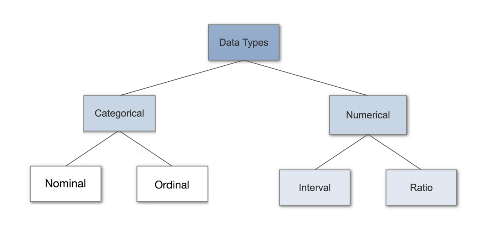
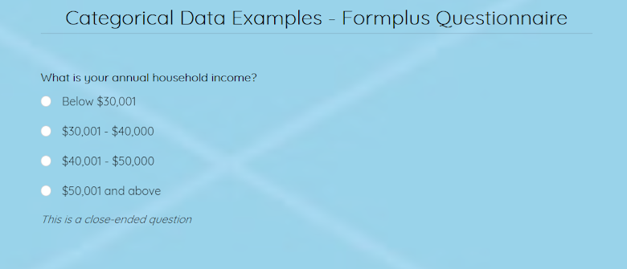
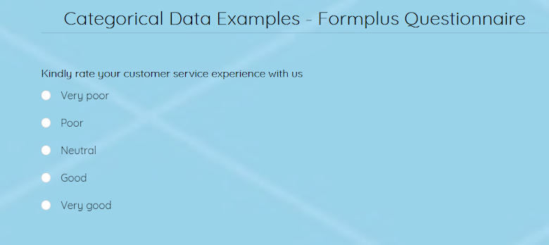
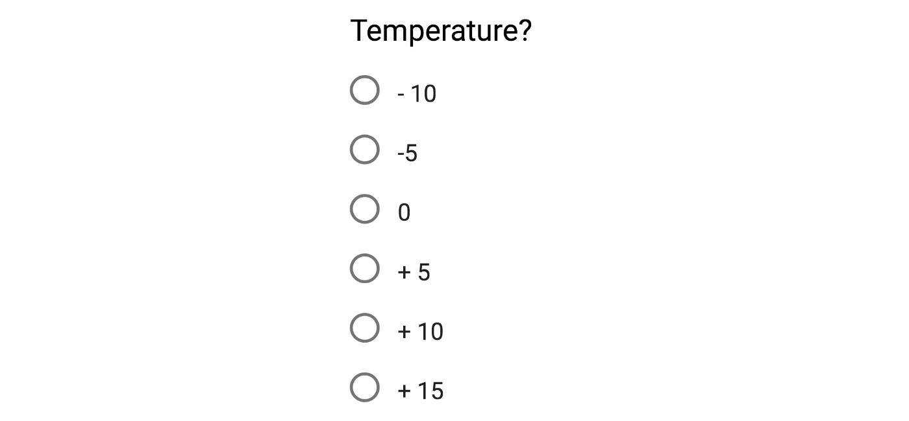
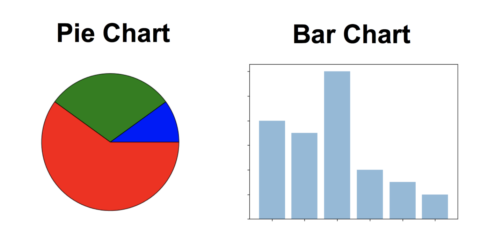
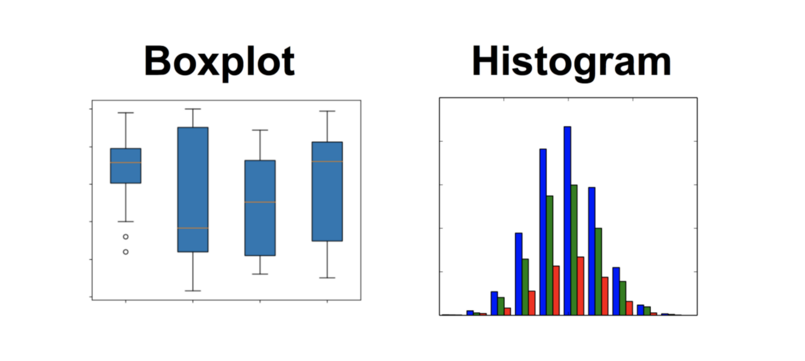

## Data Types in Statistics

Data Types are an important concept of statistics, which needs to be understood, to correctly apply statistical measurements to your data and therefore to correctly conclude certain assumptions about it. This blog post will introduce you to the different data types you need to know, to do proper exploratory data analysis (EDA), which is one of the most underestimated parts of a machine learning project.



### Introduction to Data Types

Having a good understanding of the different data types, also called measurement scales, is a crucial prerequisite for doing Exploratory Data Analysis (EDA), since you can use certain statistical measurements only for specific data types.

You also need to know which data type you are dealing with to choose the right visualization method. Think of data types as a way to categorize different types of variables. We will discuss the main types of variables and look at an example for each. We will sometimes refer to them as measurement scales.

### Categorical Data

Categorical data represents characteristics. Categorical data is a collection of information that is divided into groups. I.e, if an organisation or agency is trying to get a biodata of its employees, the resulting data is referred to as categorical. This data is called categorical because it may be grouped according to the variables present in the biodata such as sex, state of residence, etc. Therefore it can represent things like a person’s gender, language etc. Categorical data can also take on numerical values (Example: 1 for female and 0 for male). Note that those numbers don’t have mathematical meaning.

### Nominal Data

Nominal values represent discrete units and are used to label variables, that have no quantitative value. Just think of them as „labels“. Note that nominal data that has no order. Therefore if you would change the order of its values, the meaning would not change. You can see two examples of nominal features below:


The left feature that describes a persons gender would be called "dichotomous", which is a type of nominal scales that contains only two categories.

### Ordinal Data

Ordinal values represent discrete and ordered units. It is therefore nearly the same as nominal data, except that it’s ordering matters. You can see an example below:


Note that the difference between Elementary and High School is different than the difference between High School and College. This is the main limitation of ordinal data, the differences between the values is not really known. Because of that, ordinal scales are usually used to measure non-numeric features like happiness, customer satisfaction and so on.

### General Characteristics/Features of Categorical Data

- **Categories:** There consist of two categories of categorical data, namely; nominal data and ordinal data. Nominal data, also known as named data is the type of data used to name variable, while ordinal data is a type of data with a scale or order to it. 

- **Qualitativeness:** Categorical data is qualitative. That is, it describes an event using a string of words rather than numbers. 

- **Analysis:** Categorical data is analysed using mode and median distributions, where nominal data is analysed with mode while ordinal data uses both. In some cases, ordinal data may also be analysed using univariate statistics, bivariate statistics, regression applications, linear trends and classification methods. 

- **Graphical analysis:** It can also be analysed graphically using a bar chart and pie chart. A bar chart is mostly used to analyse frequency while a pie chart analysis percentage. This is done after grouping into a table. 

- **Interval scale:** In the case of ordinal data, which has a given order or scale, the scale does not have a standardised interval. This is not applicable for nominal data. 

- **Numeric values:** Although categorical data is qualitative, it may sometimes take numerical values. However, these values do not exhibit quantitative characteristics. Arithmetic operations can not be performed on them. 

- **Nature:** Categorical data may also be classified into binary and non binary depending on its nature. A given question with options “Yes” or “No” is classified as binary because it has two options while adding “Maybe” to the given options will make it non binary. 

### Categorical Data Examples 

- **Household Income:** Categorical data is mostly used by businesses when investigating the spending power of their target audience, to conclude on an affordable price for their products. For example:

**Example**



This is a closed ended nominal data example.

- **Education Level:** The level of education of a respondent may be requested for when filling forms for job applications, admission, training etc. This is used to assess their qualification for a specific role. Consider the example below:

**Example**


This is also a closed-ended nominal data example if order is not required. 

- **Gender:** Respondents are asked for their gender when filling out a biodata. This is mostly categorised as male or female, but may also be nonbinary. For example:

What is your gender?

- Male
- Female

This is a binary and closed-ended nominal data example. 

What is your gender? (Others signify) 

- Male
- Female
- Others _____

This is a nonbinary and open-closed ended nominal data example. 

**Customer satisfaction:** After rendering service to customers, businesses like to get feedback from customers regarding their service to improve. For example;



The above is an example of an ordinal data collection process. The responses have a specific order to them, listed in ascending order. 

**Brand of soaps:** When doing competitive analysis research, a soap brand may want to study the popularity of its competitors among their target audience. In this case, we have something of this nature:

Which of the following soap brands are you familiar with? 

- Lux
- Dove
- Olay

This is a multiple-choice nominal data collection example.

**Hair colour:** This is a key categorical data example used in profiling a respondent. Although not accurate, a person's hair colour together with some racially prominent traits may be used to predict whether the person is black, caucasian, Hispanic, etc. For example:

What is your hair colour? 

- Blonde
- Brunette
- Brown
- Black
- Red

This is a closed-ended example of nominal data. 

**Proficiency level:** Employees measure a job applicant's proficiency level in skills required to perform well in the job. This helps in choosing the best applicant for the job. For example:

What is your proficiency level in excel? 

- Advanced
- Intermediate
- Novice 
- 
This is a simple example of ordinal data. 

### Numerical Data

1. Discrete Data

We speak of discrete data if its values are distinct and separate. In other words: We speak of discrete data if the data can only take on certain values. This type of data can’t be measured but it can be counted. It basically represents information that can be categorized into a classification. An example is the number of heads in 100 coin flips.

You can check by asking the following two questions whether you are dealing with discrete data or not: Can you count it and can it be divided up into smaller and smaller parts?

2. Continuous Data

Continuous Data represents measurements and therefore their values can’t be counted but they can be measured. An example would be the height of a person, which you can describe by using intervals on the real number line.

### Interval Data

Interval values represent ordered units that have the same difference. Therefore we speak of interval data when we have a variable that contains numeric values that are ordered and where we know the exact differences between the values. An example would be a feature that contains temperature of a given place like you can see below:



The problem with interval values data is that they don’t have a "true zero". That means in regards to our example, that there is no such thing as no temperature. With interval data, we can add and subtract, but we cannot multiply, divide or calculate ratios. Because there is no true zero, a lot of descriptive and inferential statistics can’t be applied.

### Ratio Data

Ratio values are also ordered units that have the same difference. Ratio values are the same as interval values, with the difference that they do have an absolute zero. Good examples are height, weight, length etc.


### Why Data Types are important?

Datatypes are an important concept because statistical methods can only be used with certain data types. You have to analyze continuous data differently than categorical data otherwise it would result in a wrong analysis. Therefore knowing the types of data you are dealing with, enables you to choose the correct method of analysis.

We will now go over every data type again but this time in regards to what statistical methods can be applied. To understand properly what we will now discuss, you have to understand the basics of descriptive statistics.

### Statistical Methods

### Nominal Data

When you are dealing with nominal data, you collect information through:

**Frequencies:** The Frequency is the rate at which something occurs over a period of time or within a dataset.

**Proportion:** You can easily calculate the proportion by dividing the frequency by the total number of events. (e.g how often something happened divided by how often it could happen)

**Percentage**.

**Visualisation Methods:** To visualise nominal data you can use a pie chart or a bar chart.



In Data Science, you can use one hot encoding, to transform nominal data into a numeric feature.

### Ordinal Data

When you are dealing with ordinal data, you can use the same methods like with nominal data, but you also have access to some additional tools. Therefore you can summarise your ordinal data with frequencies, proportions, percentages. And you can visualise it with pie and bar charts. Additionally, you can use percentiles, median, mode and the interquartile range to summarise your data.

In Data Science, you can use one label encoding, to transform ordinal data into a numeric feature.

### Continuous Data

When you are dealing with continuous data, you can use the most methods to describe your data. You can summarise your data using percentiles, median, interquartile range, mean, mode, standard deviation, and range.

Visualisation Methods:

To visualise continuous data, you can use a histogram or a box-plot. With a histogram, you can check the central tendency, variability, modality, and kurtosis of a distribution. Note that a histogram can’t show you if you have any outliers. This is why we also use box-plots.



---

### One Hot Encoding

#### What is the Problem with Categorical Data?

Some algorithms can work with categorical data directly.

For example, a decision tree can be learned directly from categorical data with no data transform required (this depends on the specific implementation).

Many machine learning algorithms cannot operate on label data directly. They require all input variables and output variables to be numeric.

In general, this is mostly a constraint of the efficient implementation of machine learning algorithms rather than hard limitations on the algorithms themselves.

This means that categorical data must be converted to a numerical form. If the categorical variable is an output variable, you may also want to convert predictions by the model back into a categorical form in order to present them or use them in some application.

#### How to Convert Categorical Data to Numerical Data?

This involves two steps:

- Integer Encoding
- One-Hot Encoding

1. Integer Encoding

As a first step, each unique category value is assigned an integer value.

For example, “red” is 1, “green” is 2, and “blue” is 3.

This is called a label encoding or an integer encoding and is easily reversible.

For some variables, this may be enough.

The integer values have a natural ordered relationship between each other and machine learning algorithms may be able to understand and harness this relationship.

For example, ordinal variables like the “place” example above would be a good example where a label encoding would be sufficient.

2. One-Hot Encoding

For categorical variables where no such ordinal relationship exists, the integer encoding is not enough.

In fact, using this encoding and allowing the model to assume a natural ordering between categories may result in poor performance or unexpected results (predictions halfway between categories).

In this case, a one-hot encoding can be applied to the integer representation. This is where the integer encoded variable is removed and a new binary variable is added for each unique integer value.

One hot encoding is the most widespread approach, and it works very well unless your categorical variable takes on a large number of values (i.e. you generally won't it for variables taking more than 15 different values. It'd be a poor choice in some cases with fewer values, though that varies.)

One hot encoding creates new (binary) columns, indicating the presence of each possible value from the original data. Let's work through an example.

In the “color” variable example, there are 3 categories and therefore 3 binary variables are needed. A “1” value is placed in the binary variable for the color and “0” values for the other colors.

For example:

| color | red | green | blue |
| ----- | --- | ----- | ---- |
| red   | 1   | 0     | 0    |
| green | 0   | 1     | 0    |
| blue  | 0   | 0     | 1    |

The binary variables are often called “dummy variables” in other fields, such as statistics.

*Note: If the number of distinct values for a categorical feature is large then one hot encoding can create large and sparse vectors which is bad.* 

**Example**

Let's see this in code. We'll skip the basic data set-up code, so you can start at the point where you have train_predictors, test_predictors DataFrames. This data contains housing characteristics. You will use them to predict home prices, which are stored in a Series called target.

Pandas assigns a data type (called a dtype) to each column or Series. Let's see a random sample of dtypes from our prediction data:

```train_predictors.dtypes.sample(10)```

Output:

    Heating          object
    CentralAir       object
    Foundation       object
    Condition1       object
    YrSold            int64
    PavedDrive       object
    RoofMatl         object
    PoolArea          int64
    EnclosedPorch     int64
    KitchenAbvGr      int64
    dtype: object

**Object** indicates a column has text (there are other things it could be theoretically be, but that's unimportant for our purposes). It's most common to one-hot encode these "object" columns, since they can't be plugged directly into most models. Pandas offers a convenient function called get_dummies to get one-hot encodings. Call it like this:

```one_hot_encoded_training_predictors = pd.get_dummies(train_predictors)```

Alternatively, you could have dropped the categoricals. To see how the approaches compare, we can calculate the mean absolute error of models built with two alternative sets of predictors:

1. One-hot encoded categoricals as well as numeric predictors
2. Numerical predictors, where we drop categoricals.

One-hot encoding usually helps, but it varies on a case-by-case basis. In this case, there doesn't appear to be any meaningful benefit from using the one-hot encoded variables.

```python
from sklearn.model_selection import cross_val_score
from sklearn.ensemble import RandomForestRegressor

def get_mae(X, y):
    # multiple by -1 to make positive MAE score instead of neg value returned as sklearn convention
    return -1 * cross_val_score(RandomForestRegressor(50), 
                                X, y, 
                                scoring = 'neg_mean_absolute_error').mean()

predictors_without_categoricals = train_predictors.select_dtypes(exclude=['object'])

mae_without_categoricals = get_mae(predictors_without_categoricals, target)

mae_one_hot_encoded = get_mae(one_hot_encoded_training_predictors, target)

print('Mean Absolute Error when Dropping Categoricals: ' + str(int(mae_without_categoricals)))
print('Mean Abslute Error with One-Hot Encoding: ' + str(int(mae_one_hot_encoded)))
```

    Mean Absolute Error when Dropping Categoricals: 18350
    Mean Abslute Error with One-Hot Encoding: 18023


**Applying to Multiple Files**

So far, you've one-hot-encoded your training data. What about when you have multiple files (e.g. a test dataset, or some other data that you'd like to make predictions for)? Scikit-learn is sensitive to the ordering of columns, so if the training dataset and test datasets get misaligned, your results will be nonsense. This could happen if a categorical had a different number of values in the training data vs the test data.

Ensure the test data is encoded in the same manner as the training data with the align command:

```python
one_hot_encoded_training_predictors = pd.get_dummies(train_predictors)
one_hot_encoded_test_predictors = pd.get_dummies(test_predictors)
final_train, final_test = one_hot_encoded_training_predictors.align(one_hot_encoded_test_predictors,
                                                                    join='left', 
                                                                    axis=1)
```


The align command makes sure the columns show up in the same order in both datasets (it uses column names to identify which columns line up in each dataset.) The argument join='left' specifies that we will do the equivalent of SQL's left join. That means, if there are ever columns that show up in one dataset and not the other, we will keep exactly the columns from our training data. The argument join='inner' would do what SQL databases call an inner join, keeping only the columns showing up in both datasets. That's also a sensible choice.

### Summary

In this post, you discovered the different data types that are used throughout statistics. You learned the difference between discrete & continuous data and learned what nominal, ordinal, interval and ratio measurement scales are. Furthermore, you now know what statistical measurements you can use at which datatype and which are the right visualisation methods. You also learned, with which methods categorical variables can be transformed into numeric variables. This enables you to create a big part of an exploratory analysis on a given dataset.

Reference 1:- https://towardsdatascience.com/data-types-in-statistics-347e152e8bee

Reference 2:- https://formpl.us/blog/categorical-data

Reference 3: https://www.kaggle.com/dansbecker/using-categorical-data-with-one-hot-encoding