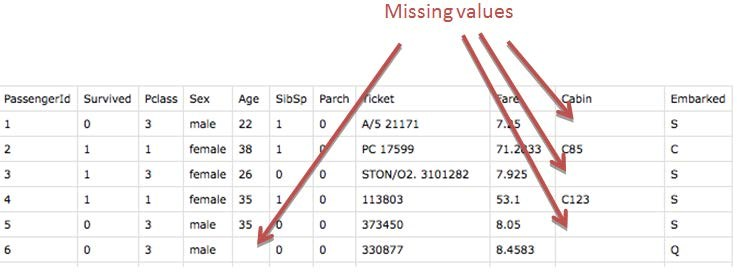
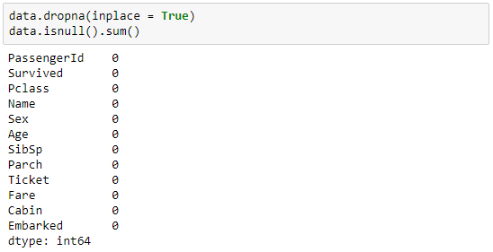
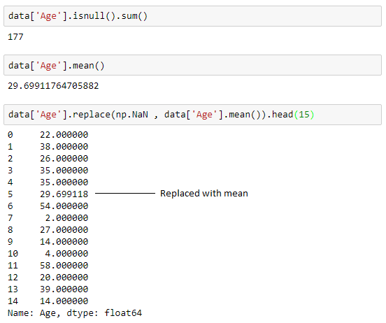
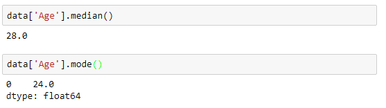
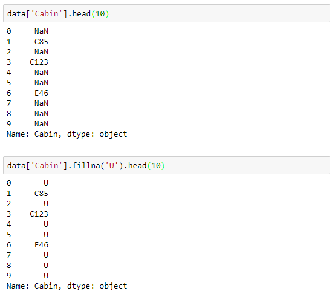
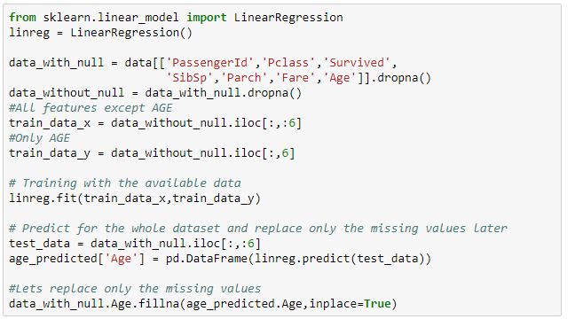

## Handling Missing Data

In real world data, there are some instances where a particular element is absent because of various reasons, such as, corrupt data, failure to load the information, or incomplete extraction. Handling the missing values is one of the greatest challenges faced by analysts, because making the right decision on how to handle it generates robust data models. Let us look at different ways of imputing the missing values.



1. Deleting Rows

This method commonly used to handle the null values. Here, we either delete a particular row if it has a null value for a particular feature and a particular column if it has more than 70-75% of missing values. This method is advised only when there are enough samples in the data set. One has to make sure that after we have deleted the data, there is no addition of bias. Removing the data will lead to loss of information which will not give the expected results while predicting the output.



Pros:

- Complete removal of data with missing values results in robust and highly accurate model
- Deleting a particular row or a column with no specific information is better, since it does not have a high weightage

Cons:

- Loss of information and data
- Works poorly if the percentage of missing values is high (say 30%), compared to the whole dataset

2. Drop Columns with Missing Values

If your data is in a DataFrame called original_data, you can drop columns with missing values. One way to do that is

```data_without_missing_values = original_data.dropna(axis=1)```

In many cases, you'll have both a training dataset and a test dataset. You will want to drop the same columns in both DataFrames. In that case, you would write

```python
cols_with_missing = [col for col in original_data.columns 
                                 if original_data[col].isnull().any()]
reduced_original_data = original_data.drop(cols_with_missing, axis=1)
reduced_test_data = test_data.drop(cols_with_missing, axis=1)
```

If those columns had useful information (in the places that were not missing), your model loses access to this information when the column is dropped. Also, if your test data has missing values in places where your training data did not, this will result in an error.

So, it's somewhat usually not the best solution. However, it can be useful when most values in a column are missing.

3. Replacing With Mean/Median/Mode(Imputation)

This strategy can be applied on a feature which has numeric data like the age of a person or the ticket fare. We can calculate the mean, median or mode of the feature and replace it with the missing values. This is an approximation which can add variance to the data set. But the loss of the data can be negated by this method which yields better results compared to removal of rows and columns. Replacing with the above three approximations are a statistical approach of handling the missing values. This method is also called as leaking the data while training. Another way is to approximate it with the deviation of neighbouring values. This works better if the data is linear.  



To replace it with median and mode we can use the following to calculate the same:



Pros:

- This is a better approach when the data size is small
- It can prevent data loss which results in removal of the rows and columns

Cons:

- Imputing the approximations add variance and bias
- Works poorly compared to other multiple-imputations method

4. Assigning An Unique Category

A categorical feature will have a definite number of possibilities, such as gender, for example. Since they have a definite number of classes, we can assign another class for the missing values. Here, the features Cabin and Embarked have missing values which can be replaced with a new category, say, U for ‘unknown’. This strategy will add more information into the dataset which will result in the change of variance. Since they are categorical, we need to find one hot encoding to convert it to a numeric form for the algorithm to understand it. Let us look at how it can be done in Python:



Pros:

- Less possibilities with one extra category, resulting in low variance after one hot encoding — since it is categorical
- Negates the loss of data by adding an unique category

Cons:

- Adds less variance
- Adds another feature to the model while encoding, which may result in poor performance

5. Predicting The Missing Values

Using the features which do not have missing values, we can predict the nulls with the help of a machine learning algorithm. This method may result in better accuracy, unless a missing value is expected to have a very high variance. We will be using linear regression to replace the nulls in the feature ‘age’, using other available features. One can experiment with different algorithms and check which gives the best accuracy instead of sticking to a single algorithm. 



Pros:

- Imputing the missing variable is an improvement as long as the bias from the same is smaller than the omitted variable bias
- Yields unbiased estimates of the model parameters

Cons:

- Bias also arises when an incomplete conditioning set is used for a categorical variable
- Considered only as a proxy for the true values

6. Using Algorithms Which Support Missing Values

KNN is a machine learning algorithm which works on the principle of distance measure. This algorithm can be used when there are nulls present in the dataset. While the algorithm is applied, KNN considers the missing values by taking the majority of the K nearest values. In this particular dataset, taking into account the person’s age, sex, class etc, we will assume that people having same data for the above mentioned features will have the same kind of fare.

Unfortunately, the SciKit Learn library for the K – Nearest Neighbour algorithm in Python does not support the presence of the missing values.

Another algorithm which can be used here is RandomForest. This model produces a robust result because it works well on non-linear and the categorical data. It adapts to the data structure taking into consideration of the high variance or the bias, producing better results on large datasets.

Pros:

- Does not require creation of a predictive model for each attribute with missing data in the dataset
- Correlation of the data is neglected

Cons:

- Is a very time consuming process and it can be critical in data mining where large databases are being extracted
- Choice of distance functions can be Euclidean, Manhattan etc. which is do not yield a robust result

Reference:- https://analyticsindiamag.com/5-ways-handle-missing-values-machine-learning-datasets/