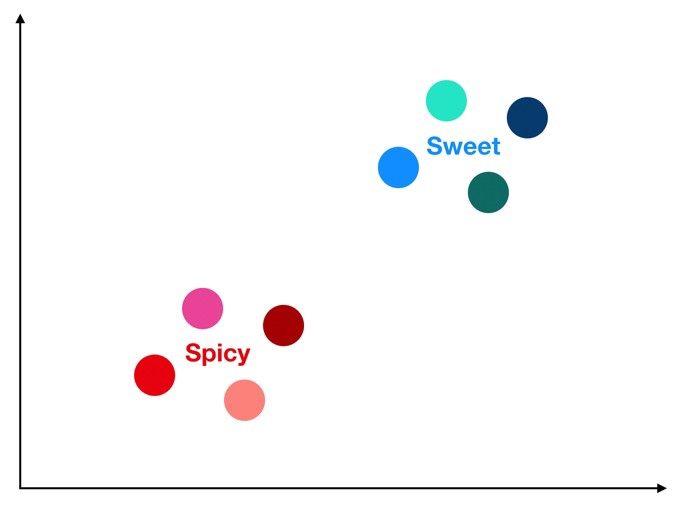
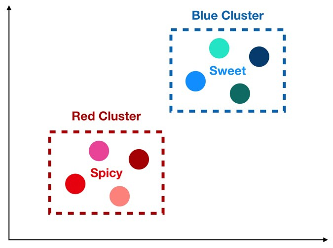
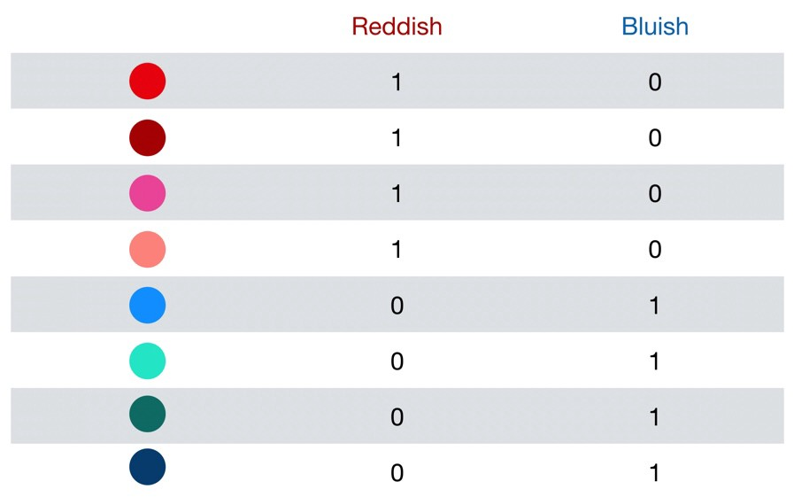
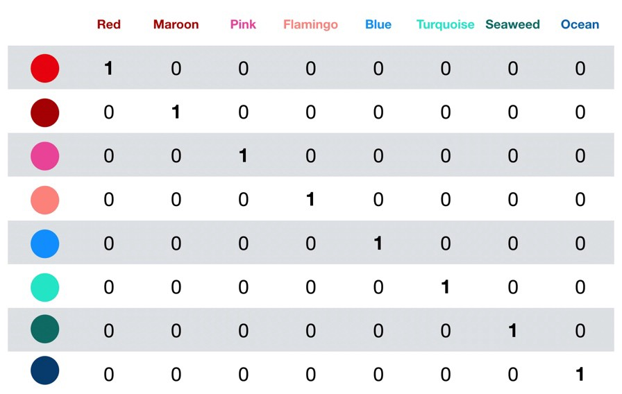
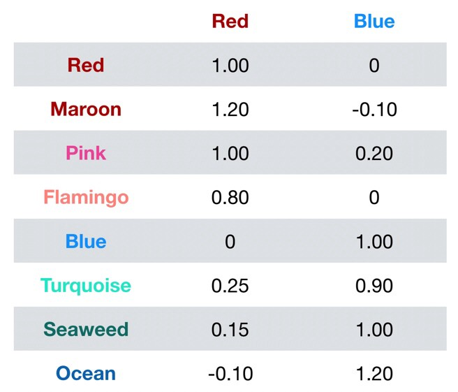
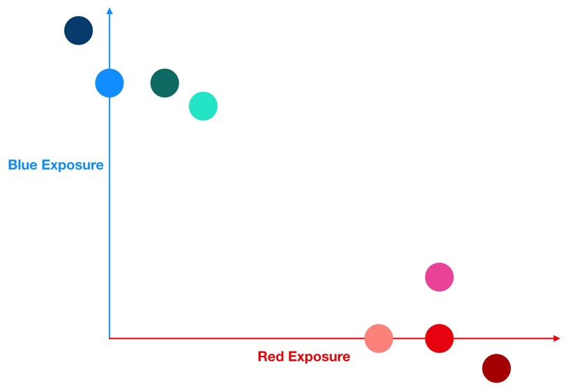

## Curse of dimensionality

Please read for more detailed information:- https://en.wikipedia.org/wiki/Curse_of_dimensionality

Have you ever been in the middle of telling someone a story or struggling through a long explanation of something complicated when the other person looks at you and asks, “What’s the point?”

First, your friend is so rude!

But we have also been in your friend’s shoes too — we are all busy people with places to go and folks to see. We want our information quick and to the point.

That is the essence of dimensionality reduction. When confronted with a ton of data, we can use dimensionality reduction algorithms to make the data “get to the point”.

### When is Data High Dimensional and Why Might That Be a Problem?

The Curse of Dimensionality sounds like something straight out of a pirate movie but what it really refers to is when your data has too many features.

The phrase, attributed to Richard Bellman, was coined to express the difficulty of using brute force (a.k.a. grid search) to optimize a function with too many input variables. Imagine running an Excel Solver optimization where there are 100,000 possible input variables, or in other words, 100,000 potential levers to pull (pretty sure that would crash your Excel).

In today’s big data world it can also refer to several other potential issues that arise when your data has a huge number of dimensions:

1. If we have more features than observations than **we run the risk of massively overfitting our model — this would generally result in terrible out of sample performance.**
2. When we have too many features, observations become harder to cluster — believe it or not, **too many dimensions causes every observation in your dataset to appear equidistant from all the others.** And because clustering uses a distance measure such as Euclidean distance to quantify the similarity between observations, this is a big problem. **If the distances are all approximately equal, then all the observations appear equally alike (as well as equally different), and no meaningful clusters can be formed.**

Point 2 is an important one so let’s use an example to see why it occurs.

### A Simple Example of High Dimensional Data Cursing Us

Imagine our dataset consists of the following 8 candies.

The ground truth is that there are two clusters within our dataset of 8 candies — spicy and sweet. So if all we cared about was getting the flavor right, how could we cluster our candies to ensure that we never accidentally give a spicy candy to our friend with the sweet tooth?

We can cluster by color like so:

Nice, thanks to our clustering we know that if we eat a reddish candy, it will be spicy; and if we eat a bluish candy, it will be sweet.

But actually it’s not that simple. As humans we are able to visually inspect the candies and quickly decide that red means spicy and blue means sweet. But a machine learning algorithm can only do so if the data is presented to it properly. If our data looks like the following table, then we are in luck — we have two features, reddish and bluish that produce perfect clusters of taste giving us a perfect model.

But what if our data is high dimensional like in the next table?

Now instead of 2 categories of colors, we have 8. How would a clustering algorithm likely interpret this? It would look at each candy and make the following conclusions:

- Every candy is its own color.
- As an algorithm (without special training), I do not know the relationships between colors. For example, unlike humans, I do not know that pink is closer to red than turquoise is.
- Given this set of features, I conclude that there are 8 clusters and they are all equally similar to each other.
- I also conclude that out of my 8 clusters, 4 are spicy and 4 are sweet.

That’s not useful at all. It is true that the candies are all different colors but this conclusion leaves us no better off than how we started. Read the last bullet again — it literally just restates what we already knew about our dataset. We have gained zero insight into how to predict whether a given candy will be spicy or sweet. So how can we fix this?

### Dimensionality Reduction to the Rescue

Below is a stylized example of how dimensionality reduction works. This is not meant to explain a specific algorithm but rather it is a simple example that demonstrates some of the principles that dimensionality reduction algorithms follow.

The algorithm starts by locating the underlying trends in our features — these can be topics such as sports or politics for text data, or the primary trend in time series data (see my Understanding PCA blog post for more details on this). For our candy dataset, the underlying trends would most likely be the primary colors red and blue. In data science, these underlying trends hidden in our features are often called latent features.

Next, the algorithm estimates and rewrites every other feature in terms of their exposures to these latent features as in the table above.

Let’s plot each candy in terms of their latent feature exposures (the numerical values in the previous table) — recall that each candy is its own unique color:

Nice! It’s pretty clear from the plot above that using our latent features (red and blue) has allowed us to produce two meaningful clusters. Finally, we can look within each cluster and count how many candies are spicy and how many are sweet and use this frequency as the basis for our predictions.

So our spicy/sweet model for candy would look something like the following:

1. Given a new candy, record its color.
2. Transform its color into exposures to the red feature and the blue feature — in other words, rewrite the color in terms of our latent features.
3. Using the latent feature exposures of our new candy, figure out whether it is more similar to the red candy cluster or the blue candy cluster using a distance measure such as Euclidean distance.
4. If our model puts it in the red cluster, we predict the new candy to be spicy (since all the red cluster candies in our original dataset were spicy). And if our model puts it in the blue cluster, we predict the new candy to be sweet (since all the blue cluster candies in our original dataset were sweet).

Example:

$f_1, f_2, f_3$ $\rightarrow$ Total no. of datapoints = $2^3$ = 8

$f_1, f_2, f_3, ..., f_10$ $\rightarrow$ Total no. of datapoints = $2^10$ = 1024

It means as dimensionality increases, the number of datapoints to perform good classification increases exponentially.

Reference:- https://towardsdatascience.com/the-curse-of-dimensionality-50dc6e49aa1e