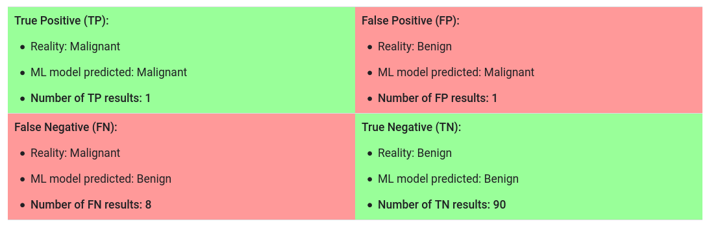

## Confusion Matrix

Confusion Matrix as the name suggests gives us a matrix as output and describes the complete performance of the model.

There are 4 important terms :

- **True Positives :** The cases in which we predicted YES and the actual output was also YES.
- **True Negatives :** The cases in which we predicted NO and the actual output was NO.
- **False Positives :** The cases in which we predicted YES and the actual output was NO.
- **False Negatives :** The cases in which we predicted NO and the actual output was YES.

For binary classification, accuracy can also be calculated in terms of positives and negatives as follows:

$Accuracy=\frac{TP + TN}{TP + TN + FP + FN}$

Where TP = True Positives, TN = True Negatives, FP = False Positives, and FN = False Negatives.

Let's try calculating accuracy for the following model that classified 100 tumors as malignant (the positive class) or benign (the negative class):

$Accuracy=\frac{TP + TN}{TP + TN + FP + FN} = \frac{1+90}{1+90+1+8} = 0.91$

Accuracy comes out to 0.91, or 91% (91 correct predictions out of 100 total examples). That means our tumor classifier is doing a great job of identifying malignancies, right?

Actually, let's do a closer analysis of positives and negatives to gain more insight into our model's performance.

Of the 100 tumor examples, 91 are benign (90 TNs and 1 FP) and 9 are malignant (1 TP and 8 FNs).

Of the 91 benign tumors, the model correctly identifies 90 as benign. That's good. However, of the 9 malignant tumors, the model only correctly identifies 1 as malignant—a terrible outcome, as 8 out of 9 malignancies go undiagnosed!

While 91% accuracy may seem good at first glance, another tumor-classifier model that always predicts benign would achieve the exact same accuracy (91/100 correct predictions) on our examples. In other words, our model is no better than one that has zero predictive ability to distinguish malignant tumors from benign tumors.

Accuracy alone doesn't tell the full story when you're working with a class-imbalanced data set, like this one, where there is a significant disparity between the number of positive and negative labels.

### True Positive Rate (Sensitivity)

True Positive Rate is defined as TP/ (FN+TP). True Positive Rate corresponds to the proportion of positive data points that are correctly considered as positive, with respect to all positive data points.

$True\ Positive\ Rate = \frac{True\ Positive}{False\ Negative + True\ Positive} = 1 - FNR$

### True Negative Rate(fall-out)

$True\ Negative\ Rate = \frac{True\ Negative}{False\ Positive + True\ Negative} = 1 - FPR$

### False Positive Rate (Specificity) 

False Positive Rate is defined as FP / (FP+TN). False Positive Rate corresponds to the proportion of negative data points that are mistakenly considered as positive, with respect to all negative data points.

$False\ Positive\ Rate = \frac{False\ Positive}{False\ Positive + True\ Negative} = 1 - TNR$

### False Negative Rate  (miss rate)

$False\ Negative\ Rate = \frac{False\ Negative}{False\ Negative + True\ Positive} = 1 - TRP$

Reference 1:- https://developers.google.com/machine-learning/crash-course/classification/accuracy

Reference 2:- https://en.wikipedia.org/wiki/Sensitivity_and_specificity