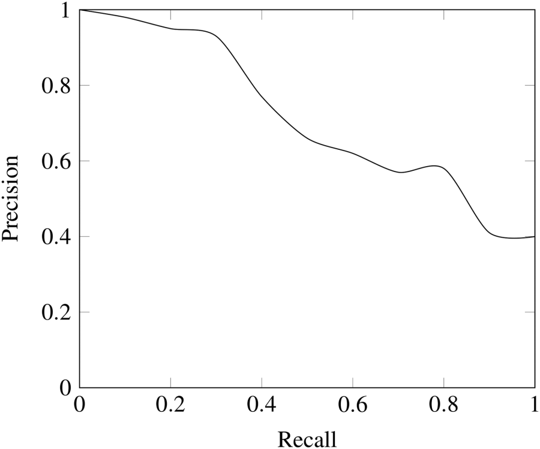
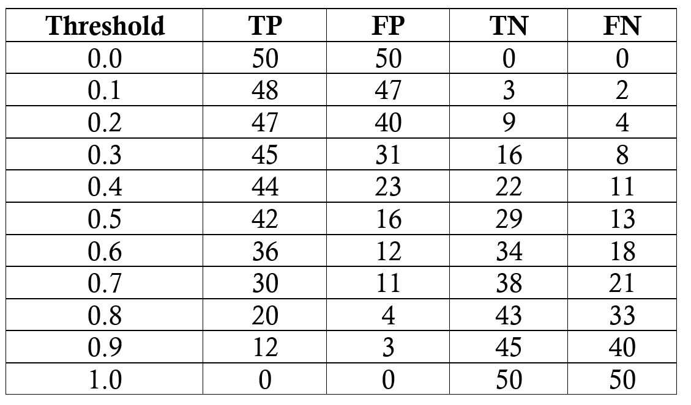
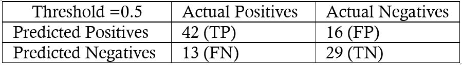
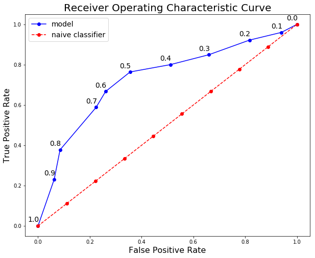
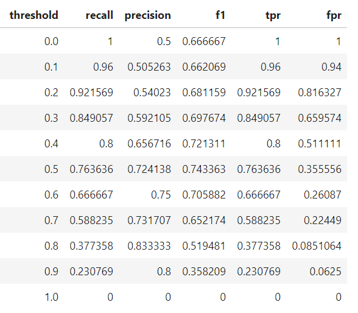

## Precision & recall, F1-score

Would you believe someone who claimed to create a model entirely in their head to identify terrorists trying to board flights with greater than 99% accuracy? Well, here is the model: simply label every single person flying from a US airport as not a terrorist. Given the 800 million average passengers on US flights per year and the 19 (confirmed) terrorists who boarded US flights from 2000–2017, this model achieves an astounding accuracy of 99.9999999%! That might sound impressive, but I have a suspicion the US Department of Homeland Security will not be calling anytime soon to buy this model. While this solution has nearly-perfect accuracy, this problem is one in which accuracy is clearly not an adequate metric!

The terrorist detection task is an imbalanced classification problem: we have two classes we need to identify — terrorists and not terrorists — with one category representing the overwhelming majority of the data points. Another imbalanced classification problem occurs in disease detection when the rate of the disease in the public is very low. In both these cases the positive class — disease or terrorist — is greatly outnumbered by the negative class. These types of problems are examples of the fairly common case in data science when accuracy is not a good measure for assessing model performance.

Intuitively, we know that proclaiming all data points as negative in the terrorist detection problem is not helpful and, instead, we should focus on identifying the positive cases. The metric our intuition tells us we should maximize is known in statistics as recall, or the ability of a model to find all the relevant cases within a dataset. The precise definition of recall is the number of true positives divided by the number of true positives plus the number of false negatives. True positives are data point classified as positive by the model that actually are positive (meaning they are correct), and false negatives are data points the model identifies as negative that actually are positive (incorrect). In the terrorism case, true positives are correctly identified terrorists, and false negatives would be individuals the model labels as not terrorists that actually were terrorists. Recall can be thought as of a model’s ability to find all the data points of interest in a dataset.

$recall=\frac{true\ positives}{true\ positives+false\ negatives}=\frac{terrorists\ correctly\ identified}{terrorists\ correctly\ identified+terrorists\ incorrectly\ labeled\ as\ not\ terrorists}$

You might notice something about this equation: if we label all individuals as terrorists, then our recall goes to 1.0! We have a perfect classifier right? Well, not exactly. As with most concepts in data science, there is a trade-off in the metrics we choose to maximize. In the case of recall, when we increase the recall, we decrease the precision. Again, we intuitively know that a model that labels 100% of passengers as terrorists is probably not useful because we would then have to ban every single person from flying. Statistics provides us with the vocabulary to express our intuition: this new model would suffer from low precision, or the ability of a classification model to identify only the relevant data points.

**Precision** is defined as the number of true positives divided by the number of true positives plus the number of false positives. False positives are cases the model incorrectly labels as positive that are actually negative, or in our example, individuals the model classifies as terrorists that are not. While recall expresses the ability to find all relevant instances in a dataset, precision expresses the proportion of the data points our model says was relevant actually were relevant.

$precision=\frac{true\ positives}{true \ positives + false\ positives}=\frac{terrorists\ correctly\ identified}{terrorists\ correctly\ identified+individuals\ incorrectly\ labeled\ as\ terrorists}$

Now, we can see that our first model which labeled all individuals as not terrorists wasn’t very useful. Although it had near-perfect accuracy, it had 0 precision and 0 recall because there were no true positives! Say we modify the model slightly, and identify a single individual correctly as a terrorist. Now, our precision will be 1.0 (no false positives) but our recall will be very low because we will still have many false negatives. If we go to the other extreme and classify all passengers as terrorists, we will have a recall of 1.0 — we’ll catch every terrorist — but our precision will be very low and we’ll detain many innocent individuals. In other words, as we increase precision we decrease recall and vice-versa.

### Combining Precision and Recall

In some situations, we might know that we want to maximize either recall or precision at the expense of the other metric. For example, in preliminary disease screening of patients for follow-up examinations, we would probably want a recall near 1.0 — we want to find all patients who actually have the disease — and we can accept a low precision if the cost of the follow-up examination is not significant. However, in cases where we want to find an optimal blend of precision and recall we can combine the two metrics using what is called the F1 score.

The F1 score is the harmonic mean of precision and recall taking both metrics into account in the following equation:

$F_1=2 * \frac{precision \times recall}{precision+recall}$

We use the harmonic mean instead of a simple average because it punishes extreme values. A classifier with a precision of 1.0 and a recall of 0.0 has a simple average of 0.5 but an F1 score of 0. The F1 score gives equal weight to both measures and is a specific example of the general Fβ metric where β can be adjusted to give more weight to either recall or precision. (There are other metrics for combining precision and recall, such as the Geometric Mean of precision and recall, but the F1 score is the most commonly used.) If we want to create a balanced classification model with the optimal balance of recall and precision, then we try to maximize the F1 score.

### Visualizing Precision and Recall

I’ve thrown a couple new terms at you and we’ll walk through an example to show how they are used in practice. Before we can get there though we need to briefly talk about tw concepts used for showing precision and recall.

First up is the confusion matrix which is useful for quickly calculating precision and recall given the predicted labels from a model. A confusion matrix for binary classification shows the four different outcomes: true positive, false positive, true negative, and false negative. The actual values form the columns, and the predicted values (labels) form the rows. The intersection of the rows and columns show one of the four outcomes. For example, if we predict a data point is positive, but it actually is negative, this is a false positive.

Going from the confusion matrix to the recall and precision requires finding the respective values in the matrix and applying the equations:

$recall=\frac{true\ positives}{true\ positives+false\ negatives}$

$precision=\frac{true\ positives}{true\ positives+false\ positives}$

The other main visualization technique for showing the performance of a classification model is the **Receiver Operating Characteristic (ROC) curve**. Don’t let the complicated name scare you off! The idea is relatively simple: the ROC curve shows how the recall vs precision relationship changes as we vary the threshold for identifying a positive in our model. The threshold represents the value above which a data point is considered in the positive class. If we have a model for identifying a disease, our model might output a score for each patient between 0 and 1 and we can set a threshold in this range for labeling a patient as having the disease (a positive label). By altering the threshold, we can try to achieve the right precision vs recall balance.

An ROC curve plots the true positive rate on the y-axis versus the false positive rate on the x-axis. The true positive rate (TPR) is the recall and the false positive rate (FPR) is the probability of a false alarm. Both of these can be calculated from the confusion matrix:

$TPR=\frac{TP}{TP+FN}$

$FPR=\frac{FP}{FP+TN}$

A typical ROC curve is shown below:

The black diagonal line indicates a random classifier and the red and blue curves show two different classification models. For a given model, we can only stay on one curve, but we can move along the curve by adjusting our threshold for classifying a positive case. Generally, as we decrease the threshold, we move to the right and upwards along the curve. With a threshold of 1.0, we would be in the lower left of the graph because we identify no data points as positives leading to no true positives and no false positives (TPR = FPR = 0). As we decrease the threshold, we identify more data points as positive, leading to more true positives, but also more false positives (the TPR and FPR increase). Eventually, at a threshold of 0.0 we identify all data points as positive and find ourselves in the upper right corner of the ROC curve (TPR = FPR = 1.0).

Finally, we can quantify a model’s ROC curve by calculating the total **Area Under the Curve (AUC)**, a metric which falls between 0 and 1 with a higher number indicating better classification performance. In the graph above, the AUC for the blue curve will be greater than that for the red curve, meaning the blue model is better at achieving a blend of precision and recall. A random classifier (the black line) achieves an AUC of 0.5.

### Recap

We’ve covered a few terms, none of which are difficult on their own, but which combined can be a little overwhelming! Let’s do a quick recap and then walk through an example to solidly the new ideas we learned.

**Four Outcomes of Binary Classification**

- True positives: data points labeled as positive that are actually positive
- False positives: data points labeled as positive that are actually negative
- True negatives: data points labeled as negative that are actually negative
- False negatives: data points labeled as negative that are actually positive

**Recall and Precision Metrics**

- Recall: ability of a classification model to identify all relevant instances
- Precision: ability of a classification model to return only relevant instances
- F1 score: single metric that combines recall and precision using the harmonic mean

**Visualizing Recall and Precision**

- Confusion matrix: shows the actual and predicted labels from a classification problem
- Receiver operating characteristic (ROC) curve: plots the true positive rate (TPR) versus the false positive rate (FPR) as a function of the model’s threshold for classifying a positive
- Area under the curve (AUC): metric to calculate the overall performance of a classification model based on area under the ROC curve

### Example Application

Our task will be to diagnose 100 patients with a disease present in 50% of the general population. We will assume a black box model, where we put in information about patients and receive a score between 0 and 1. We can alter the threshold for labeling a patient as positive (has the disease) to maximize the classifier performance. We will evaluate thresholds from 0.0 to 1.0 in increments of 0.1, at each step calculating the precision, recall, F1, and location on the ROC curve. Following are the classification outcomes at each threshold:

We’ll do one sample calculation of the recall, precision, true positive rate, and false positive rate at athreshold of 0.5. First we make the confusion matrix:

We can use the numbers in the matrix to calculate the recall, precision, and F1 score:

$recall=\frac{TP}{TP+FN}=\frac{42}{42+13}=0.76$

$precision=\frac{TP}{TP+FP}=\frac{42}{42+16}=0.724$

$F_1=2 * \frac{precision \times recall}{precision+recall}=0.74$

Then we calculate the true positive and false positive rate to find the y and x coordinates for the ROC curve.

$TPR=\frac{TP}{TP+FN}=\frac{42}{42+13}=0.76$

$FPR=\frac{FP}{FP+TN}=\frac{16}{16+29}=0.36$

To make the entire ROC curve, we carry out this process at each threshold. As you might think, this is pretty tedious, so instead of doing it by hand, we use a language like Python to do it for us! The Jupyter Notebook with the calculations is on GitHub for anyone to see the implementation. The final ROC curve is shown below with the thresholds above the points.

Here we can see all the concepts come together! At a threshold of 1.0, we classify no patients as having the disease and hence have a recall and precision of 0.0. As the threshold decreases, the recall increases because we identify more patients that have the disease. However, as our recall increases, our precision decreases because in addition to increasing the true positives, we increase the false positives. At a threshold of 0.0, our recall is perfect — we find all patients with the disease — but our precision is low because we have many false positives. We can move along the curve for a given model by changing the threshold and select the threshold that maximizes the F1 score. To shift the entire curve, we would need to build a different model.

Final model statistics at each threshold are below:

Based on the F1 score, the overall best model occurs at a threshold of 0.5. If we wanted to emphasize precision or recall to a greater extent, we could choose the corresponding model that performs best on those measures.

### Conclusions

We tend to use accuracy because everyone has an idea of what it means rather than because it is the best tool for the task! Although better-suited metrics such as recall and precision may seem foreign, we already have an intuitive sense of why they work better for some problems such as imbalanced classification tasks. Statistics provides us with the formal definitions and the equations to calculate these measures. Data science is about knowing the right tools to use for a job, and often we need to go beyond accuracy when developing classification models. Knowing about recall, precision, F1, and the ROC curve allows us to assess classification models and should make us think skeptically about anyone touting only the accuracy of a model, especially for imbalanced problems. As we have seen, accuracy does not provide a useful assessment on several crucial problems, but now we know how to employ smarter metrics!

Reference:- https://towardsdatascience.com/beyond-accuracy-precision-and-recall-3da06bea9f6c