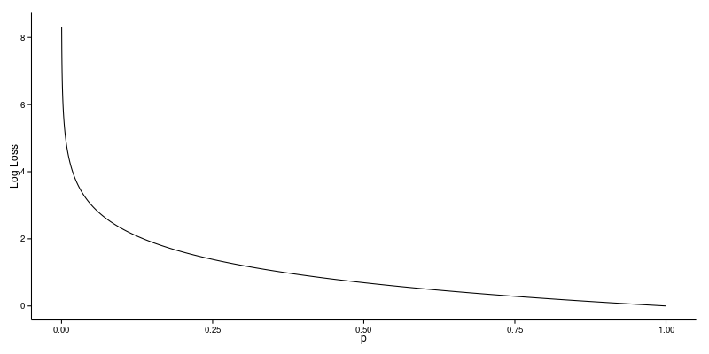

## Logarithmic Loss(https://towardsdatascience.com/understanding-binary-cross-entropy-log-loss-a-visual-explanation-a3ac6025181a)

Logarithmic Loss or Log Loss, works by penalising the false classifications. It works well for multi-class classification. When working with Log Loss, the classifier must assign probability to each class for all the samples. Suppose, there are N samples belonging to M classes, then the Log Loss is calculated as below :

$Logarithmic\ Loss=\frac{-1}{N} \sum_{i=1}^{N} \sum_{j=1}^{M}y_{ij}\times log(p_{ij})$

where,

$y_{ij}$, indicates whether sample i belongs to class j or not

$p_{ij}$, indicates the probability of sample i belonging to class j

Log Loss has no upper bound and it exists on the range [0, ∞). Log Loss nearer to 0 indicates higher accuracy, whereas if the Log Loss is away from 0 then it indicates lower accuracy.

In general, minimising Log Loss gives greater accuracy for the classifier.

### Making Sense of Logarithmic Loss

Log Loss quantifies the accuracy of a classifier by penalising false classifications. Minimising the Log Loss is basically equivalent to maximising the accuracy of the classifier, but there is a subtle twist which we’ll get to in a moment.

In order to calculate Log Loss the classifier must assign a probability to each class rather than simply yielding the most likely class. Mathematically Log Loss is defined as

$$ - \frac{1}{N} \sum_{i=1}^N \sum_{j=1}^M y_{ij} \log \, p_{ij} $$

where N is the number of samples or instances, M is the number of possible labels, $y_{ij}$ is a binary indicator of whether or not label j is the correct classification for instance i, and $p_{ij}$ is the model probability of assigning label j to instance i. A perfect classifier would have a Log Loss of precisely zero. Less ideal classifiers have progressively larger values of Log Loss. If there are only two classes then the expression above simplifies to

$$ - \frac{1}{N} \sum_{i=1}^N [y_{i} \log \, p_{i} + (1 - y_{i}) \log \, (1 - p_{i})].$$

Note that for each instance only the term for the correct class actually contributes to the sum.

### Log Loss Function

Let’s consider a simple implementation of a Log Loss function:

```python
LogLossBinary = function(actual, predicted, eps = 1e-15) {
	predicted = pmin(pmax(predicted, eps), 1-eps)
	- (sum(actual * log(predicted) + (1 - actual) * log(1 - predicted))) / length(actual)
}
```

Suppose that we are training a binary classifier and consider an instance which is known to belong to the target class. We’ll have a look at the effect of various predictions for class membership probability.

    > LogLossBinary(1, c(0.5))  
    [1] 0.69315  
    > LogLossBinary(1, c(0.9))  
    [1] 0.10536  
    > LogLossBinary(1, c(0.1))  
    [1] 2.3026

In the first case the classification is neutral: it assigns equal probability to both classes, resulting in a Log Loss of 0.69315. In the second case the classifier is relatively confident in the first class. Since this is the correct classification the Log Loss is reduced to 0.10536. The third case is an equally confident classification, but this time for the wrong class. The resulting Log Loss escalates to 2.3026. Relative to the neutral classification, being confident in the wrong class resulted in a far greater change in Log Loss. Obviously the amount by which Log Loss can decrease is constrained, while increases are unbounded.

### Looking Closer

Let’s take a closer look at this relationship. The plot below shows the Log Loss contribution from a single positive instance where the predicted probability ranges from 0 (the completely wrong prediction) to 1 (the correct prediction). It’s apparent from the gentle downward slope towards the right that the Log Loss gradually declines as the predicted probability improves. Moving in the opposite direction though, the Log Loss ramps up very rapidly as the predicted probability approaches 0. That’s the twist I mentioned earlier.



Log Loss heavily penalises classifiers that are confident about an incorrect classification. For example, if for a particular observation, the classifier assigns a very small probability to the correct class then the corresponding contribution to the Log Loss will be very large indeed. Naturally this is going to have a significant impact on the overall Log Loss for the classifier. The bottom line is that it’s better to be somewhat wrong than emphatically wrong. Of course it’s always better to be completely right, but that is seldom achievable in practice! There are at least two approaches to dealing with poor classifications:

1. Examine the problematic observations relative to the full data set. Are they simply outliers? In this case, remove them from the data and re-train the classifier.
2. Consider smoothing the predicted probabilities using, for example, Laplace Smoothing. This will result in a less “certain” classifier and might improve the overall Log Loss.

### Code Support for Log Loss

Using Log Loss in your models is relatively simple. [XGBoost](https://github.com/dmlc/xgboost) has ```logloss``` and ```mlogloss``` options for the ```eval_metric``` parameter, which allow you to optimise your model with respect to binary and multiclass Log Loss respectively. Both metrics are available in caret’s ```train()``` function as well. The [Metrics](https://cran.r-project.org/web/packages/Metrics/index.html) package also implements a number of Machine Learning metrics including Log Loss.

Reference:- https://datawookie.netlify.app/blog/2015/12/making-sense-of-logarithmic-loss/
