## Conditional Probability(https://en.wikipedia.org/wiki/Conditional_probability)

Life is full of random events! You need to get a "feel" for them to be a smart and successful person. 

### Independent Events

Events can be "Independent", meaning each event is not affected by any other events.

**Example:** Tossing a coin.

Each toss of a coin is a perfect isolated thing.

What it did in the past will not affect the current toss.

The chance is simply 1-in-2, or 50%, just like ANY toss of the coin.

So each toss is an Independent Event.

### Dependent Events

But events can also be "dependent" ... which means they can be affected by previous events ... 

**Example:** Marbles in a Bag

2 blue and 3 red marbles are in a bag.

What are the chances of getting a blue marble?

The chance is 2 in 5

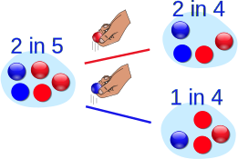

But after taking one out the chances change!

So the next time:

if we got a red marble before, then the chance of a blue marble next is 2 in 4

if we got a blue marble before, then the chance of a blue marble next is 1 in 4

This is because we are removing marbles from the bag.

So the next event depends on what happened in the previous event, and is called dependent. 

**Replacement**

Note: if we replace the marbles in the bag each time, then the chances do not change and the events are independent:

With Replacement: the events are Independent (the chances don't change)
Without Replacement: the events are Dependent (the chances change)

Dependent events are what we look at here.

### Tree Diagram

A Tree Diagram: is a wonderful way to picture what is going on, so let's build one for our marbles example.

There is a 2/5 chance of pulling out a Blue marble, and a 3/5 chance for Red:

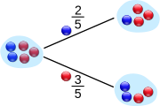

We can go one step further and see what happens when we pick a second marble:

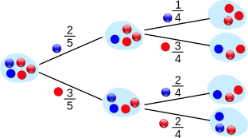

If a blue marble was selected first there is now a 1/4 chance of getting a blue marble and a 3/4 chance of getting a red marble.

If a red marble was selected first there is now a 2/4 chance of getting a blue marble and a 2/4 chance of getting a red marble.

Now we can answer questions like "What are the chances of drawing 2 blue marbles?"

Answer: it is a 2/5 chance followed by a 1/4 chance:

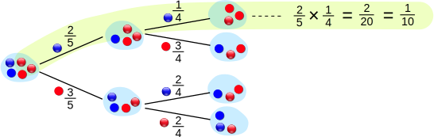

Did you see how we multiplied the chances? And got 1/10 as a result.

The chances of drawing 2 blue marbles is 1/10

### Notation

We love notation in mathematics! It means we can then use the power of algebra to play around with the ideas. So here is the notation for probability:

P(A) means "Probability Of Event A"

In our marbles example Event A is "get a Blue Marble first" with a probability of 2/5:

P(A) = 2/5

And Event B is "get a Blue Marble second" ... but for that we have 2 choices:

- If we got a Blue Marble first the chance is now 1/4
- If we got a Red Marble first the chance is now 2/4

So we have to say which one we want, and use the symbol "|" to mean "given":

P(B|A) means "Event B given Event A"

In other words, event A has already happened, now what is the chance of event B?

P(B|A) is also called the "Conditional Probability" of B given A.

And in our case:

P(B|A) = 1/4

So the probability of getting 2 blue marbles is:

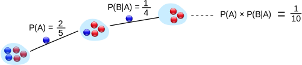

And we write it as

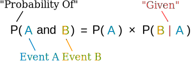

"Probability of event A and event B equals the probability of event A times the probability of event B given event A"

Let's do the next example using only notation:

**Example:** Drawing 2 Kings from a Deck

Event A is drawing a King first, and Event B is drawing a King second.

For the first card the chance of drawing a King is 4 out of 52 (there are 4 Kings in a deck of 52 cards):

P(A) = 4/52

But after removing a King from the deck the probability of the 2nd card drawn is less likely to be a King (only 3 of the 51 cards left are Kings):

P(B|A) = 3/51

And so:

P(A and B) = P(A) x P(B|A) = (4/52) x (3/51) = 12/2652 = 1/221

So the chance of getting 2 Kings is 1 in 221, or about 0.5%

### Finding Hidden Data

Using Algebra we can also "change the subject" of the formula, like this:

Start with: 	  	P(A and B) = P(A) x P(B|A)

Swap sides: 	  	P(A) x P(B|A) = P(A and B)

Divide by P(A): 	P(B|A) = P(A and B) / P(A)

And we have another useful formula:

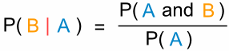

"The probability of event B given event A equals the probability of event A and event B divided by the probability of event A

**Example:** Ice Cream

70% of your friends like Chocolate, and 35% like Chocolate AND like Strawberry.

What percent of those who like Chocolate also like Strawberry?

P(Strawberry|Chocolate) = P(Chocolate and Strawberry) / P(Chocolate)
0.35 / 0.7 = 50%

50% of your friends who like Chocolate also like Strawberry

### Big Example: Soccer Game

You are off to soccer, and want to be the Goalkeeper, but that depends who is the Coach today:

- with Coach Sam the probability of being Goalkeeper is 0.5
- with Coach Alex the probability of being Goalkeeper is 0.3

Sam is Coach more often ... about 6 out of every 10 games (a probability of 0.6).

So, what is the probability you will be a Goalkeeper today?

 

Let's build a tree diagram. First we show the two possible coaches: Sam or Alex:

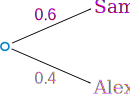

The probability of getting Sam is 0.6, so the probability of Alex must be 0.4 (together the probability is 1)

Now, if you get Sam, there is 0.5 probability of being Goalie (and 0.5 of not being Goalie):

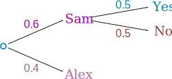

If you get Alex, there is 0.3 probability of being Goalie (and 0.7 not):

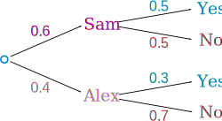

The tree diagram is complete, now let's calculate the overall probabilities. Remember that:

P(A and B) = P(A) x P(B|A)

Here is how to do it for the "Sam, Yes" branch:

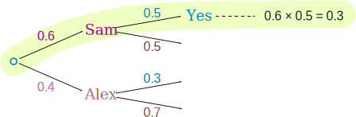

(When we take the 0.6 chance of Sam being coach times the 0.5 chance that Sam will let you be Goalkeeper we end up with an 0.3 chance.)

But we are not done yet! We haven't included Alex as Coach:

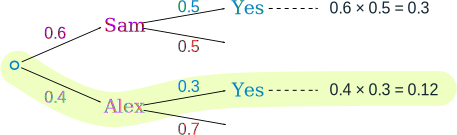

An 0.4 chance of Alex as Coach, followed by an 0.3 chance gives 0.12

And the two "Yes" branches of the tree together make:

0.3 + 0.12 = 0.42 probability of being a Goalkeeper today

(That is a 42% chance)

**Check**

One final step: complete the calculations and make sure they add to 1:

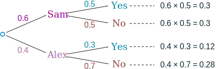

0.3 + 0.3 + 0.12 + 0.28 = 1

Yes, they add to 1, so that looks right.

### Friends and Random Numbers

Here is another quite different example of Conditional Probability.

4 friends (Alex, Blake, Chris and Dusty) each choose a random number between 1 and 5. What is the chance that any of them chose the same number?

Let's add our friends one at a time ...

 
First, what is the chance that Alex and Blake have the same number?

Blake compares his number to Alex's number. There is a 1 in 5 chance of a match.

As a tree diagram:

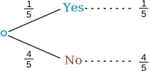

Note: "Yes" and "No" together  makes 1
(1/5 + 4/5 = 5/5 = 1)

Now, let's include Chris ...

But there are now two cases to consider:

- If Alex and Blake did match, then Chris has only one number to compare to.
- But if Alex and Blake did not match then Chris has two numbers to compare to.

And we get this:

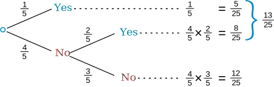

For the top line (Alex and Blake did match) we already have a match (a chance of 1/5).

But for the "Alex and Blake did not match" there is now a 2/5 chance of Chris matching (because Chris gets to match his number against both Alex and Blake).

And we can work out the combined chance by multiplying the chances it took to get there:

    Following the "No, Yes" path ... there is a 4/5 chance of No, followed by a 2/5 chance of Yes:
    (4/5) × (2/5) = 8/25

    Following the "No, No" path ... there is a 4/5 chance of No, followed by a 3/5 chance of No:
    (4/5) × (3/5) = 12/25

Also notice that when we add all chances together we still get 1 (a good check that we haven't made a mistake):

(5/25) + (8/25) + (12/25) = 25/25 = 1

Now what happens when we include Dusty?

It is the same idea, just more of it:

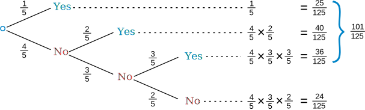

OK, that is all 4 friends, and the "Yes" chances together make 101/125:

Answer: 101/125

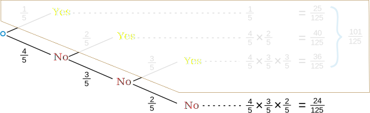

The chances of not matching are:

(4/5) × (3/5) × (2/5) = 24/125

So the chances of matching are:

1 - (24/125) = 101/125

(And we didn't really need a tree diagram for that!)

And that is a popular trick in probability:

It is often easier to work out the "No" case
(and subtract from 1 for the "Yes" case) 

Reference:- https://www.mathsisfun.com/data/probability-events-conditional.html