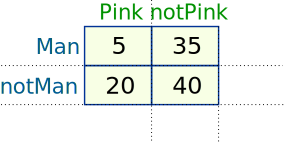
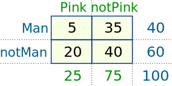
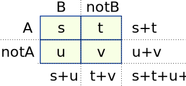
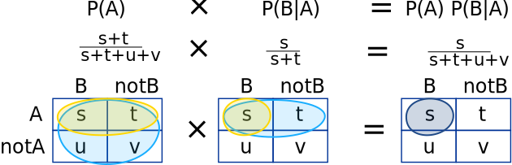

## Bayes Theorem(https://en.wikipedia.org/wiki/Bayes%27_theorem)

Bayes’ Theorem is a way of finding a probability when we know certain other probabilities.

The formula is:

$P(A|B) = \frac{P(A) \times P(B|A)}{P(B)} ; P(B) \not ={0}$ 

Which tells us: how often A happens given that B happens, written P(A|B) also called as posterior probability, 
When we know: how often B happens given that A happens, written P(B|A) also called as likelihood probability 
and how likely A is on its own, written P(A) also called as prior probability 
and how likely B is on its own, written P(B) also called as evidence probability

Let us say P(Fire) means how often there is fire, and P(Smoke) means how often we see smoke, then:

- P(Fire|Smoke) means how often there is fire when we can see smoke
- P(Smoke|Fire) means how often we can see smoke when there is fire

So the formula kind of tells us "forwards" P(Fire|Smoke) when we know "backwards" P(Smoke|Fire)

**Example:**

- dangerous fires are rare (1%)
- but smoke is fairly common (10%) due to barbecues,
- and 90% of dangerous fires make smoke

We can then discover the probability of dangerous Fire when there is Smoke:

$P(Fire|Smoke) =\frac{P(Fire) \times P(Smoke|Fire)}{P(Smoke)}$ 
$=\frac{1\% \times 90\%}{10\%}$ 
$=9%$

So it is still worth checking out any smoke to be sure.

**Example: Picnic Day**

You are planning a picnic today, but the morning is cloudy

- Oh no! 50% of all rainy days start off cloudy!
- But cloudy mornings are common (about 40% of days start cloudy)
- And this is usually a dry month (only 3 of 30 days tend to be rainy, or 10%)

What is the chance of rain during the day?

We will use Rain to mean rain during the day, and Cloud to mean cloudy morning.

The chance of Rain given Cloud is written P(Rain|Cloud)

So let's put that in the formula:

$P(Rain|Cloud) = \frac{P(Rain) \times P(Cloud|Rain)}{P(Cloud)}$

- P(Rain) is Probability of Rain = 10%
- P(Cloud|Rain) is Probability of Cloud, given that Rain happens = 50%
- P(Cloud) is Probability of Cloud = 40%

$P(Rain|Cloud) = \frac{0.1 \times 0.5}{0.4}  = .125$

Or a 12.5% chance of rain. Not too bad, let's have a picnic!

**Just 4 Numbers**

Imagine 100 people at a party, and you tally how many wear pink or not, and if a man or not, and get these numbers:

Bayes' Theorem is based off just those 4 numbers!

Let us do some totals:

And calculate some probabilities:

- the probability of being a man is P(Man) = $\frac{40}{100}$ = 0.4
- the probability of wearing pink is P(Pink) = $\frac{25}{100}$ = 0.25
- the probability that a man wears pink is P(Pink|Man) = $\frac{5}{40}$ = 0.125
- the probability that a person wearing pink is a man P(Man|Pink) = ...

But alll your data is ripped up! Only 3 values survive:

- P(Man) = 0.4,
- P(Pink) = 0.25 and
- P(Pink|Man) = 0.125

**Can you discover P(Man|Pink) ?**

Imagine a pink-wearing guest leaves money behind ... was it a man? We can answer this question using Bayes' Theorem:

$P(Man|Pink) = \frac{P(Man) \times P(Pink|Man)}{P(Pink)}$

$P(Man|Pink) = \frac{0.4 \times 0.125}{0.25} = 0.2$

*Note: if we still had the raw data we could calculate directly $\frac{5}{25} = 0.2$*

**Being General**

Why does it work?

Let us replace the numbers with letters:

Now let us look at probabilities. So we take some ratios:

- the overall probability of "A" is $P(A) = \frac{s+t}{s+t+u+v}$
- the probability of "B given A" is $P(B|A) = \frac{s}{s+t}$

And then multiply them together like this:

Now let us do that again but use P(B) and P(A|B):

Both ways get the same result of $\frac{s}{s+t+u+v}$

So we can see that:

$P(B) \times P(A|B) = P(A) \times P(B|A)$

Nice and symmetrical isn't it?

It actually has to be symmetrical as we can swap rows and columns and get the same top-left corner.

And it is also **Bayes Formula** ... just divide both sides by P(B):

$P(A|B) = \frac{P(A) \times P(B|A)}{P(B)}$

### Remembering

First think "AB AB AB" then remember to group it like: "AB = A BA / B"

$P(A|B) = \frac{P(A) P(B|A)}{P(B)}$

### Cat Allergy?

One of the famous uses for Bayes Theorem is False Positives and False Negatives.

For those we have two possible cases for "A", such as Pass/Fail (or Yes/No etc)

**Example: Allergy or Not?**

Hunter says she is itchy. There is a test for Allergy to Cats, but this test is not always right:

- For people that really do have the allergy, the test says "Yes" 80% of the time
- For people that do not have the allergy, the test says "Yes" 10% of the time ("false positive")

If 1% of the population have the allergy, and Hunter's test says "Yes", what are the chances that Hunter really has the allergy?

We want to know the chance of having the allergy when test says "Yes", written P(Allergy|Yes)

Let's get our formula:

$P(Allergy|Yes) = \frac{P(Allergy) \times P(Yes|Allergy)}{P(Yes)}$

- P(Allergy) is Probability of Allergy = 1%
- P(Yes|Allergy) is Probability of test saying "Yes" for people with allergy = 80%
- P(Yes) is Probability of test saying "Yes" (to anyone) = ??%

Oh no! We don't know what the general chance of the test saying "Yes" is ...

... but we can calculate it by adding up those with, and those without the allergy:

- 1% have the allergy, and the test says "Yes" to 80% of them
- 99% do not have the allergy and the test says "Yes" to 10% of them

Let's add that up:

$P(Yes) = 1\% \times 80\% + 99\% \times 10\% = 10.7\%$

Which means that about 10.7% of the population will get a "Yes" result.

So now we can complete our formula:

$P(Allergy|Yes) = \frac{1\% \times 80\%}{10.7\%}  = 7.48\%$

$P(Allergy|Yes) = about\ 7\%$

This is the same result we got on False Positives and False Negatives.

In fact we can write a special version of the Bayes' formula just for things like this:

$P(A|B) = \frac{P(A) \times P(B|A)}{P(A) \times P(B|A) + P(not A) \times P(B|not A)}$

### "A" With Three (or more) Cases

We just saw "A" with two cases (A and not A), which we took care of in the bottom line.

When "A" has 3 or more cases we include them all in the bottom line:

$P(A1|B) = \frac{P(A1)P(B|A1)}{P(A1)P(B|A1) + P(A2)P(B|A2) + P(A3)P(B|A3) + ...etc}$

**Example: The Art Competition has entries from three painters: Pam, Pia and Pablo**

- Pam put in 15 paintings, 4% of her works have won First Prize.
- Pia put in 5 paintings, 6% of her works have won First Prize.
- Pablo put in 10 paintings, 3% of his works have won First Prize.

What is the chance that Pam will win First Prize?

$P(Pam|First) = \frac{P(Pam)P(First|Pam)}{P(Pam)P(First|Pam) + P(Pia)P(First|Pia) + P(Pablo)P(First|Pablo)}$

Put in the values:

$P(Pam|First) = \frac{(15/30) × 4\%}{(15/30) × 4\% + (5/30) × 6\% + (10/30) × 3\%}$

Multiply all by 30 (makes calculation easier):

$P(Pam|First) = \frac{15 × 4\%}{15 × 4\% + 5 × 6\% + 10 × 3\%}$
$=\frac{0.6}{0.6 + 0.3 + 0.3}$
$=50\%$

A good chance!

Pam isn't the most successful artist, but she did put in lots of entries.

Reference:- https://www.mathsisfun.com/data/bayes-theorem.html